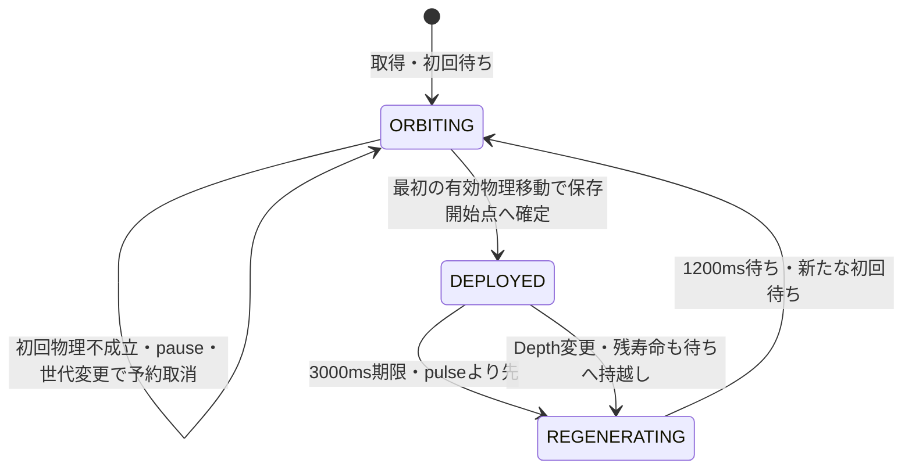

# KGK-02 UMBRA SERAPH Phase 5 実装・検証報告

Phase 5：PHANTOM NOVA基本攻撃と3スキル共存の実装結果。正式Stage成長、Mutation、装備対応、通常販売は未着手

## 1. 今回の承認と比較基準

今回の明示的なPhase 5着手承認に従い、検証S1と3武装共存までを実装した。過去報告の「後続へ進まない」は当時の範囲として保持する。BLOOD SPIKEの成長要望はPhase 6向け未承認候補のまま。過去の操作感確認や今回の自動試験を、全端末の性能・正式バランス・人間による最終合格へ読み替えない。

AGENTS.md、README.md、現存するPhase 1素材記録、Phase 2A・Air Brake・2B、Phase 3・4、Phase 4遅延補足、成長メモと現行コードを確認。独立したPhase 0報告は見つからず、読了済みとはしていない。

開始HEADは `28cfe5ab71048b0487254dceef6f66f3a25788f9`。開始game.js SHA-256は依頼の `85093a6d5121846fc3988854ec5737f98808e3f4b1862efdb4edcb94194db96e` と一致。比較基準はこの作業ツリーのPhase 4完成状態とAir Brake tunedであり、Git HEADの旧実装ではない。

開始時点でREADME.md/game.js/index.html/skillDefinitions.jsは変更済み、docs/tests/専用モジュール/画像は未追跡を含んでいた。開始status・hashと82ファイルのコピーを `.tmp_umbra_phase5/start-status.txt`、`start-hashes.json`、`baseline/` に新規保存した。過去報告・証跡は上書きしていない。

## 2. 検証S1と数値

|項目|周回|残留|
|---|---:|---:|
|raw基礎威力|2|3|
|探索射程（実bodyの最近点まで）|220px|300px|
|基本pulse間隔|900ms|500ms|
|Fire Control下限|300ms|200ms|
|持続|次の有効な切離しまで|3000ms未満|

共通rawは `base + max(0, stats.bulletDamage - 1)`。既存 `applyDamageToEnemy(enemy, raw, tint, null)` の一度の受付で永続・CD・OVERDRIVE・敵固有補正を適用する。返り値undefinedを成功とはせず、HP差／実効損失／撃破／拒否を分ける。

`q=clamp((fireInterval-160)/380,0,1)`、周回 `round(300+600q)`、残留 `round(200+300q)`。Reactor／Fire Controlは共通statを一度だけ更新し、カードはNOVAの周回と次の設置の効果を分ける。周回の待機中deadlineは引き寄せず、次の待ちから短縮を使用。DEPLOYEDのraw・range・interval・寿命・再生成時間は正常設置時のsnapshotで固定する。

正式S1枠数1、検証専用2/3枠。周回半径80px・4000ms、設置間隔800ms、現存DEPLOYEDとの距離120px、再生成1200ms、素材8コマ8fps。Fire Controlはこれらを変更しない。正式 `stages: []`、`previewOnly`、通常候補・販売許可は維持する。

## 3. 状態と所有・更新順



NOVA予約は総枠内のORBITING枠への参照で、球を増やさない。通知callbackは予約と最初の物理評価結果だけを保持する。既存Trace/MOONLIGHT、SPIKE、その後のNOVA WORLD_STEPの順に実行。NOVA専用許可時計を一度進め、予約確定→期限→再生成→現在位置→pulseの順に処理する。Scene/物理step/vendorの設定や既存通知順序は変更しない。

正常startごとに一度だけ条件評価。枠なし・cooldown・距離不足・壁・bounds不成立は、そのboost中に再評価しない。最初の物理評価が無移動／保守除外なら取消し、後で動いても復活しない。確定前に解除した場合も取消す。取消では前回設置時刻を更新しない。通知OFFは新設置を止め、独立時計の周回・既設置・再生成は続ける。

同Scene更新の各slotは最大1pulse。期限と一致する6発目はない。大catch-upは過去攻撃をまとめて適用せず、省略予定を理由と件数に記録する。単一物理deltaで期限を越えた場合と、期限前の複数実stepを順に実行した場合は区別する。

## 4. 対象・共存・ライフサイクル

NOVA専用生存世代Mapを使い、円／矩形の現在bodyから最短点を求める。球→最近点LOS、周回時はさらにプレイヤーbody→球LOSを確認。遮断された最寄り候補は飛ばして到達可能な候補を選ぶ。拒否受付後は同pulseで別対象へ再試行しない。slot順は安定し、同一pulse・同一lifeの重複受付と同期再入を防ぐ。別slotは生存確認後に独立受付する。

MOONLIGHTの通過・再命中MapとSPIKE castはNOVAからリセットしない。旧世代callback／emitter配送途中のresetでも、破棄前handlerは新runtimeの時計や予約に作用しない。

pause・hidden・候補画面は予約を取消し、位相・寿命・再生成・設置待ちと専用FXの戦闘時計を凍結する。通常boost終了、Air Brake、同Depthワープ、カメラ外、機体からの距離は既設置を終了させない。Depth変更では旧座標・対象・雷撃を消し、既設置枠を残留残り＋再生成待ちに変換する。他枠の残りと総数を保持し、重複hookは加算しない。死亡・終了・context/機体/技能変更・Scene shutdown・Final RaidではNOVAの所有物のみ破棄する。通常Depth10は許可する。

## 5. 表示と安全入口

既存PNG・8矩形・pivot・metadata scale 0.38はそのまま。小さい周回球は元scale×0.45、残留球は×0.62。画像全体の追加回転はなく、周回は論理位置で表現する。球と雷撃にbody/colliderはない。雷撃は成功受付のみ、最大12件・戦闘時計180ms。ダメージ数字は既存の上限12件。履歴は各128件、診断HUDは100ms以下の頻繁な更新を避け、同じ文字列を再設定しない。

再生成開始時は直前の表示objectだけを150msで収縮する。これは1200msの待ち時間内の純粋な演出で、論理位置はnull、追加攻撃はない。直前位置・frame・pivotを保ち、pauseでは収縮も止める。Depth/技能cleanup、初観測がREGENERATINGの場合、FX OFFから戻した場合は消えた球を作り直さない。

### 人間用URL・操作

- NOVA単体: `http://127.0.0.1:4173/?umbraPreview=1&umbraDrive=1&umbraPhantomNova=1`
- 3武装: `http://127.0.0.1:4173/?umbraPreview=1&umbraDrive=1&umbraPhantomNova=1&umbraMoonlight=1&umbraBloodSpike=1`
- 3枠検証: 上記へ `&umbraNovaSlots=3`。`1/2/3`以外は1へ戻す。
- 通知OFF: 上記へ `&umbraTraceNotify=0`。表示のみOFFは `&umbraTrace=0`。

WASD／矢印で移動、SHIFT／SPACEでブースト。Pで停止／復帰、Rで新規試験、TでTrace表示、Lで候補確認。画面の武装選択でなし／各単体／各2武装／3武装、配置選択で「周回放電」「開始点へ後から接近」「残留から離脱」、壁・角・集団・敵なしを選ぶ。武装・枠・fixture変更は同じ新規条件からリセットする。FX画像／簡易／OFFとpauseはruntimeをリセットしない。全枠再生成待ちは専用説明を出す。接触OFF/被弾ONを画面で区別し、隠れた無限ENや無敵はない。

## 6. 検証記録

開発時の失敗・再試行データも同じ新規証跡ディレクトリに保持する。全体の機能試験と、特定境界の数値body試験を合算して「実ブラウザ全条件」とはしない。

開始前: pure124/124、実SPIKE261/261、MOONLIGHT105/105、移動・EN・保存隔離の既存drive試験PASS。機能試験の制御Game.stepは通常rAFの滑らかさを示す測定ではない。

現行pureは182/182（既存124、NOVA runtime32、数値16、表示10）。実SPIKE261/261、MOONLIGHT105/105も最終game.jsでPASS。新NOVAは30Hz38件・60Hz44件・120Hz38件、通知OFF1件、実PNG404 1件の計122ケース。原通知/実固定60Hz物理を使い、物理0step中の開始→解除、Scene内複数physics、実壁押し、EN不足による開始失敗、制動中の周回、既設置中の通知OFF、円/矩形の300px境界±0.01、3武装の単一撃破とXP/drop経路各1回を含む。周回/残留/再生成・取得8構成・pause/hidden/候補・Depth・Final Raid・cleanup・画像/簡易/OFFは別々のcaseとして記録する。

### 開始状態との厳密比較と検証ハーネスの問題

3機体×3fixture×3Hzの空場を baseline/current NOVA OFF/current NOVA ON で比較し、敵ありはUMBRAの3fixture×3Hzをbaseline/current OFFで比較した。**全63比較で全Scene/物理rowの位置・速度・EN・AP・AirBrake・Evade・通知A/Bが完全一致**。所有run世代とlife/cast IDの先頭所有世代だけ正規化し、数値・通過ID・時刻を丸めていない。

元ハーネスは全99runを保持した後、巨大assertion差分の整形が疑われる長時間処理（観測CPU520秒・RSS5896MB）に入った。ブラウザ測定後のNodeプロセスだけを停止し、99 raw JSONと元ハーネス・停止記録を保持した。後続のoffline comparatorは1ペアずつ読む方式と最初の差分path/valueだけの出力に変更し、約1.5～1.7秒・観測RSS最大約224～240MBで比較できた。攻撃回数を落としたり、失敗rawを削除したりしていない。

元条件の全項目厳密比較は54/63一致・敵あり9差分のまま。9件とも、旧2武装の生存中HP/body/life、MOONLIGHT全snapshot（再命中時刻・pass ID・skips含む）、SPIKEの全damage counts・cast/impact/終了時刻・威力、runStats、XPは一致。差は**死亡済みの描画オブジェクトの破棄frameと、その間のSPIKE `TARGET_UNREGISTERED` 診断件数**だった。baseline/60Hz例は両版とも366.66666666666606msでHP−2・同じ撃破だが、描画破棄は2033.3333対4033.3333ms、最終skipは1対4。

現物で、死亡処理が150msのTween onCompleteからdestroyし、vendored TweenManagerの原getDeltaがSceneへ与えたdeltaではなく `Date.now()-prevTime` を読むことを確認した。元条件は物理/攻撃時計だけ制御し、Tweenは壁時計だった。これは元の同期比較が同一の演出時計になっていなかった問題である。追加の `--combat-aligned` 条件では原getDelta内部のDate.now読取りだけにScene時刻を供給し、元getDelta/Tween/終了callback/物理/攻撃を実行する。テスト専用Tweenのclock4値とmethodはfinallyで復元し、製品や通常rAFの時計は変更しない。元の9差分を見なかったことにはしない。

元ハーネス独自の「衝突は全条件0」「全fixtureでAirBrake必須」という仮定も、baselineとcurrentの同じ10設定で失敗していた。既存rawのpass:falseは保持し、後続ではこの誤った一律仮定を観測値へ戻した。衝突・AirBrakeを含む全rowの厳密一致、実際の再命中と受付の確認は維持する。

**追加の時計整列条件は18 runs／9比較すべてPASS。** 死亡オブジェクトの破棄frameとSPIKEの診断件数を含め、元比較と同じ全項目で完全一致した。HP/命中/期限/物理や期待値を緩めた結果ではない。時計の混在が元9差分の原因だったことを、この同条件比較で確認できた。通常rAFの製品挙動を修正したという意味ではない。記録は `.tmp_umbra_phase5/parity-final/2026-09-06T10-57-46-845Z-nova-baseline-parity-report.json` と同ディレクトリの18 raw・開始metadata。最終12 source manifestとの一致、fresh contextのStorageデータAPI0・外部要求0・通常入口0、存在確認probeのみを確認した。

記録: `.tmp_umbra_phase5/baseline-parity/`（99 raw）、`parity-offline-audit/2026-09-06T10-45-04-108Z-offline-parity-report.json`、元ハーネス `parity-offline-audit/umbra-nova-baseline-parity.original-6a1e41eb.cjs`、`parity-comparison-interruption.json`。後刻のoffline記録で現行Arena hashが不一致なのは、raw取得後にPhase5 HUD4行を修正したためで、rawのsourceが変わった意味ではない。

### 開発中の修正・再試行と画面確認

- 旧generationの高order/endが新予約へ作用する順序、旧emitter配送が新runtimeを進める境界、期限越えで捨てたpulse件数の診断不足を実装中に修正し、専用pure再現試験を追加。既存Trace/旧2武装は変更しなかった。
- 新browserの初期2失敗は、ハーネスの標準機ID誤記と存在しないTimer一覧API参照。実ID `defaultBear` と実Clock配列へ修正した。
- 30Hzでは「880ms以上まで進める」観測点が実物理900msへ達していたため、期限前確認を850ms以後の実点へ移した。放電deadlineは900msのまま。
- 同じく30HzのAirBrake caseでは、900msの周回放電より制動開始933.3333msが後だった。開始前待ちだけを100ms早めて、実制動中のpulse確認を行った。製品のhold70ms/制動200msや速度を変更していない。
- 最初の3枠画像でHUD2箇所の重なりを確認。Phase5内4行のfont/Y/行間だけを修正し、3slot時の実getBoundsはinfo下端230→totals開始245、totals下端297→slot開始306、slot下端414→reason開始429、reason下端453→ボタン上端459.5で非重複を確認した。Phase3/4分岐不変。

実ブラウザのArrowRight＋Shiftイベントで切離しし、周回・残留・全再生成・復帰・3枠・候補の7画面を保存した。Reactor/Fireの見た目確認だけは実候補を明示選択する表示fixtureを使用し、カードpoolや性能を変えていない。画像は `.tmp_umbra_phase5/visual-review-final/`。これは自動キーボード入力と制御stepによる表示確認で、人間の最終評価ではない。HUD修正後に通常rAF性能を再測定した。

### 計測範囲

|試験|時計・実行|測定内|測定外／制約|
|---|---|---|---|
|純状態・数値・表示|VM、明示数値body/イベント|状態・受付・式・上限のassert|実Phaser衝突/描画/実端末Hzの証明ではない|
|制御Game.step機能試験|Scene30/60/120、Arcade固定60|既存Scene/物理/描画、Trace記録listener|post-step詳細snapshot・JSON保存。描画を同期連続投入するためrAF性能と別|
|開始状態との同条件照合|実Game.step、空場・同入力列|全Scene/全物理row、通知順、旧武装履歴|初期の試験時計・World蓄積値を揃える。既存step/fps/更新順は変更しない|
|通常rAF性能8条件|既存TimeStep、実40秒ずつ|Game.step全体と包括時間wrapper、既存HUD/FX/描画|新規敵準備、数値row採取、snapshot、JSON保存、画像取得。追加の詳細snapshot listenerなし|
|画面記録|独立fresh context、実キーボードイベント＋制御step|論理状態と描画の一致確認|性能測定後。人間の操作感や実リフレッシュレート評価ではない|

性能測定は単一ブラウザを直列実行し、他の自動ブラウザ試験を並行させなかった。OS/他アプリの負荷や実GPUの所要時間は制御・測定していない。Phaser 3.70、headless Chromium、SwiftShader。画像は開始前の既存Loaderで読み込むので、「初回」は初回設置／描画側の区間でありネットワーク読込込みのcold startではない。

### 同条件の通常rAF結果

全条件はbaseline、1枠、FX画像、診断ON、カメラ固定、接触OFF。16/128体の既存Elite通常Boss定義を同じ座標列 `(350+34*(i%8),590+34*floor(i/8))` へ配置し、HPを直接書き換えていない。入力は実時間1000msから8000ms間隔で右/左を交互に、DASH180ms→逆方向470ms→解除。同じ予定列だが、rAFによる適用時刻の量子化とTimeStepの実物理経過は異なるため、実行時刻列も生データに残した。敵は40秒間生存し、追加再配置は0。敵・球が消えた空区間だけの測定にはしていない。

|敵数|武装|n|平均ms|中央値ms|p95ms|p99ms|最大ms|100ms以上|rAF間隔平均ms|rAF p99ms|
|---:|---|---:|---:|---:|---:|---:|---:|---:|---:|---:|
|16|なし|2089|2.189|2.200|2.900|3.200|8.400|0|19.164|33.400|
|16|旧2武装|2093|2.325|2.300|3.100|3.900|6.000|0|19.136|33.400|
|16|NOVA|1858|2.358|2.300|3.100|3.500|6.000|0|21.548|33.400|
|16|3武装|2055|2.396|2.400|3.200|3.900|8.000|0|19.481|33.400|
|128|なし|1140|5.508|5.500|6.400|7.000|11.600|0|35.146|50.100|
|128|旧2武装|1110|5.905|5.800|7.100|8.400|12.000|0|36.082|50.100|
|128|NOVA|1135|5.717|5.600|6.700|7.300|11.800|0|35.301|50.100|
|128|3武装|1118|6.057|6.000|7.200|8.800|12.200|0|35.839|50.100|

Game.step全体は12,598サンプル。100ms以上0は**今回の通常rAF320秒分に限った結果**。CPU側の同期呼出経過と見た目のrAF間隔を区別し、CPU時間からGPU待ちを推定しない。Phase 4同期試験の800.3ms/Phase 3の565.3msとの悪化率・改善率は計算しない。根本遅延の解消・長時間全端末合格とはしていない。

|敵数|武装|Scene更新|物理step|物理経過ms|設置/終了/再生成|周回/残留pulse|NOVA受付|MOON受付|SPIKE cast/impact/受付|
|---:|---|---:|---:|---:|---|---|---:|---:|---|
|16|なし|2089|2392|39866.67|—|—|0|0|0/0/0|
|16|旧2武装|2093|2390|39833.33|—|—|0|20|23/23/280|
|16|NOVA|1858|2378|39633.33|5/5/5|18/25|39|0|0/0/0|
|16|3武装|2055|2388|39800.00|5/5/5|20/25|45|23|23/22/296|
|128|なし|1140|2279|37983.33|—|—|0|0|0/0/0|
|128|旧2武装|1110|2270|37833.33|—|—|0|40|22/21/621|
|128|NOVA|1135|2277|37950.00|5/5/5|17/25|40|0|0/0/0|
|128|3武装|1118|2273|37883.33|5/5/5|17/25|41|34|22/21/720|

全条件の撃破0。耐久対象で受付を継続している。NOVAあり4条件は全て、同一runtime・同一枠で5回設置、各回残留5pulse、再生成5回を完了。最初と2～5回目の時刻は `firstAndRepeated`、全受付時刻は `pulseHistory` に残す。40秒で物理時間が約37.8～39.9秒になる差は、既存TimeStepの起動120callback補正と平滑化を保持した結果を含む。初回観測 `_coolDown=119`、末尾0。1基が期限内でスキップされたpulseは0で、周回総数の差を武装の性能差とは扱わない。

最初8秒と以後32秒の平均Game.stepは、16体で 2.227→2.179 / 2.450→2.293 / 2.471→2.329 / 2.537→2.360ms、128体で 5.635→5.475 / 5.975→5.887 / 5.867→5.679 / 6.243→6.010ms（なし/旧2/NOVA/3武装）。初回区間には起動補正も含むので純粋な画像費用差ではない。

全条件でgame/Scene/world listener数の前後一致。表示物のピークは16体で149/173/154/176、128体で485/511/490/513。開始inventoryは敵生成前なので、その後の+3×敵数をリークとは数えない。Timerピークは16体で0/32/2/32、128体で0/78/2/96、末尾は0/12/0/0と0/0/0/2。既存ダメージ受付の一時Timerも含み、NOVA専用Timer追加は0。全Timerが常に0であるという主張ではない。専用rayの同時最大はこの1枠試験で1、遷移履歴20・受付履歴は39～45（設定上限各128）。繰返しreset/旧callbackの別機能試験と合わせて確認したが、40秒より長期の無増加保証ではない。

敵準備の実時間費用は16体5.0～5.7ms、128体25.1～26.8msでGame.step測定外。継続中の再配置費用0。数値row採取時間はcaptureMsとして別に残し、CPUの包括wrapperは親子を足し合わせない。各フレームの処理内訳と全外れ値を保存し、100ms以上がないため該当内訳の行は0件。

生データ: `.tmp_umbra_phase5/performance-final/nova-performance-1788692230985.json`。表はHUD4行修正後の最終Arena版で再測定した結果。修正前の同条件8試験 `.tmp_umbra_phase5/performance/nova-performance-1788690589689.json`（12,689サンプル、100ms以上0）も保持する。短い試験のp99やNOVA入口だけの所要時間から武装描画/ゲーム全体の性能合格とはしない。512体は今回16/128で必要なサイクルと測定を得られたため追加していない。

## 7. 変更範囲・未着手

製品/検証入口: game.js、skillDefinitions.js、umbraDriveRuntime.js、umbraDrive.js、umbraMoonlightArena.js、index.html、README.md。index.htmlは変更JSのcache識別子更新のみ。新規pure・表示・実Phaser・同条件比較・性能ハーネスと本報告を追加。既存統計テスト2件のNOVA未定義期待各1行は、今回承認されたverificationStage1存在へ更新し、正式未公開期待は維持。

保存キー追加なし。GEEK／ANJU MEMORY／LOST ARMS／DATA CACHE／OVERDRIVE／STABILIZE／Shop／Ranking／Firebaseの永続挙動は変更しない。隔離arenaは既存の実ダメージ・撃破・drop helperをRAM adapterから呼び、通常auth/save/ranking入口へ進めない。新規実セーブ・本番account・外部通信は使用しない。

既存HUDの重複更新、SwiftShader同期描画遅延の根本修正、角脱出の断続失敗／保守除外、boostSustain名不一致、Deep丸め差は据え置く。敵HP・上限・報酬・画像再圧縮・移動・Air Brake tuned・EN・無敵・APを変更しない。

## 8. 保存確認・最終ソース・実行方法

`source-preservation-audit.json` の厳密本文照合では、既存3219メソッドのうち3214が空白・コメントを含め完全一致、変更5、追加26、削除0。既存変更はspawn2箇所へのNOVA生存登録、killEnemyのNOVA Map削除、取得武装照合、パッシブ候補の5件。移動/AirBrake/Evade179、EN33、Trace16、MOONLIGHT26、SPIKE20の保護対象は全本文一致（分類は重複するので合算しない）。ダメージ本体も同一。27PNG、metadata、equipmentDefinitions、vendor、AGENTS、rules、stageDefinitions、過去docs9件は開始snapshotのSHA-256と一致する。

NOVAの追加に必要な既存数値テスト2件の期待更新各1行以外、既存31試験ファイル中29件もbyte一致。過去の期待を広く変更してPASSにしていない。最終HUD4行の調整はPhase5分岐だけで、攻撃・移動本文およびPhase3/4表示分岐を変更しない。

最終game.js SHA-256:

```text
fd27f20c159682ae7363654b238e49f29b8327e2703900205ccbf129a9e0a451
```

最終製品12 sourceのhashは `.tmp_umbra_phase5/final-sources.json`、元freezeは `final-source-hashes.json`、最終実体コピーは `final-source-ui2/`。重要な他ファイル:

```text
skillDefinitions.js  6419d22bef1bc442f493bab841b3863c3b46ad54b63f7749ea9a52bdf7284cfa
umbraMoonlightArena.js  78dfcd83989d8dc49ea2509104a3368a4074628b51fcfd3949abcca1b7b0e723
```

新規・変更ハーネスは各JSONのharnessSha256、または最終 `final-artifact-hashes.json` で対応する。UI調整前/後、ハーネスの観測点修正前/後、壁時計/時計整列の結果を別ファイルに保存した。実測後に生データを最新hashの測定だったことへ書き換えていない。

最終HUD版でNOVA122/122とpure182/182を再確認した。NOVA rawは `.tmp_umbra_phase5/browser-final/nova-final-1788692501842.json`、pure logは `final-unit-ui2.txt`。配信12 source＋27 PNGのHTTP200とlocal/served/期待hashは39/39一致し、`final-http-ui2-hashes.json` へ記録した。最終集約は `completion-evidence.json`。開始HEADは末尾でも同じで、commit/push/deploy/reset/clean/依存追加/vendor変更/AGENTS変更は行っていない。

実行コマンド（Windows、既存インストール済みNode/Playwright/Chromiumを使用、インストールなし）:

```powershell
node --check game.js
node --check skillDefinitions.js
node --check stageDefinitions.js
node --test (Get-ChildItem tests -Filter 'umbra-*.test.cjs').FullName
node tests/umbra-nova-browser.cjs --final
node tests/umbra-bloodspike-browser.cjs --matrix-only --final
node tests/umbra-phase4-moonlight-browser.cjs
node tests/umbra-nova-parity-offline.cjs
node --expose-gc --max-old-space-size=512 tests/umbra-nova-baseline-parity.cjs --combat-aligned
node tests/umbra-nova-performance.cjs
node tests/umbra-nova-visual.cjs
git diff --check
```

ブラウザ各回は `UMBRA_TEST_OUTPUT` を新規ディレクトリへ指定する。比較は `UMBRA_TEST_MANIFEST=.tmp_umbra_phase5/final-sources.json`、既存環境の `NODE_PATH` と `UMBRA_TEST_BROWSER` を使用。標準起動は既存の `python -m http.server 4173 --bind 127.0.0.1`。新たな本番アカウント・実セーブ・外部ネットワークは使用しない。

## 9. 判断の境界と次の人間確認

- **確認できた**: 検証S1の独立枠・予約・5pulse・再生成、基本共存、対象形状/LOS/実ダメージ、保護コードと素材の維持。制御比較の死亡描画差はTweenとSceneの時計混在で、時計整列した全9比較では差がなくなる。
- **支持する証拠はあるが未確定**: 今回の通常rAFで大きなGame.step遅延が再現せず、Phase4で示唆された同期連続投入・SwiftShader環境の影響と整合する。しかしこれだけで過去の全外れ値の原因を特定したり、修正完了とはしない。
- **今回判断できない**: 実GPUの待ち時間、全端末・長時間の滑らかさ、深層全構成のバランス、人間が感じる球の見え方・切離し・頻度の妥当性。実本番Gate/Relay/Final Raidへの出撃・実保存・通常購入は実行していない。隔離Contextでの同等hook/フラグと通常公開抑止を確認した範囲を超えて一般化しない。

Phase 6へ進む前に、人間が1枠の周回→切離し→残留→全再生成待ちを試し、3武装の役割、敵集団での見やすさ、Reactor/Fire表示と体感を確認する必要がある。BLOOD SPIKEの半径成長案も別途承認が必要。今回の数値と自動試験は正式性能や最終合格の確定ではない。

正式成長、Mutation、TRIAD、装備の3武装対応、通常HANGER・販売・所有保存、Phase 6は未着手。今回の報告で停止する。人間による球の見え方、放電頻度、切離しの納得感、3武装の役割と実端末性能の再確認が必要。

## 10. Phase 6A着手時の人間確認追記（2026-09-06）

ユーザーより、Phase 5について人間確認で問題なしとの報告。確認された基本動作・表示を後続成長設計の基準として維持する。

端末、fixture、枠数、全武装組合せの確認範囲は未指定である。全端末・深層バランス・過去の遅延解消まで合格とは扱わない。上記の「当時は人間確認前」という記録はその時点の履歴として残す。成長数値・Mutationは未承認の設計案として [Phase 6A設計書](umbra-phase6a-design.md) に分け、今回の人間確認を後続実装や通常公開の自動承認としない。
