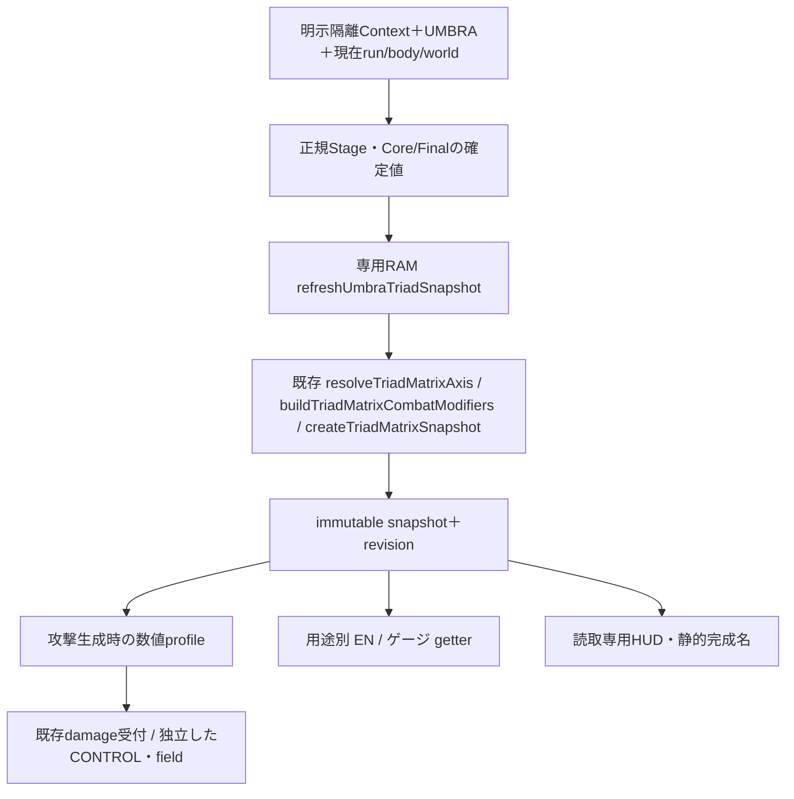

# KGK-02 UMBRA SERAPH — Phase 6D1 TRIAD MATRIX戦闘接続

作業日: 2026-09-08。TRIADの戦闘集計・9Core/9Finalとの組合せ効果・既存EN/ゲージ倍率・HUDを明示隔離入口へ接続する検証実装。SENSOR/ARMAMENT/COMBAT LINK/OVERLIMITと装備snapshotは6D2へ残し、今回の自動試験を人間の体感・全端末・公開版バランスの合格とはしない。

## 1. 着手時状態、変更ファイル、配信版

AGENTS.md、README、6A設計の今回採用部分、6B/6C1/6C2報告と攻撃・時計・隔離の既存記録を確認。HEADは `28cfe5ab71048b0487254dceef6f66f3a25788f9`、着手game.jsは指定された6C2最終 `5d7cdaa03fa7f47eac63cfab5a93d1bfb9eedd0c1764e6a2c11c78c266d365d4` と一致した。

着手時からREADME/game/index/skillDefinitionsに未commit差分、docs/tests/専用module/画像に未追跡成果がある。これら135ファイルの実体とhashを新規 `.tmp_umbra_phase6d1/2026-09-08-start/baseline/` と `start-manifest.json` へ保存し、比較元に使用した。古いHEAD/6B/6C1/legacy Brakeへ戻していない。

| 変更ファイル | 目的 |
|---|---|
| game.js | 固定3IDのRAM TRIAD、正規commit後の集計、用途別getter接続、主/副/CONTROL/fieldのsnapshot計算、カード実効値、専用bootstrap |
| umbraDrive.js | TRIAD専用見出し・既存選択UIとの接続 |
| umbraDriveRuntime.js | 純計算・専用RAM・用途別関数だけを明示借用 |
| umbraDriveFixtures.js | 明示triadEnabled Context |
| umbraMoonlightArena.js | 軸/係数/旧snapshot HUD、比較用新規試走と配置 |
| index.html | game.jsのコード版だけ `umbra-phase6d1-v1` |
| README / 6C2報告 / 本報告 | 現行入口、人間確認の追記、今回の証跡と残課題 |
| 新規 tests/umbra-triad-*.cjs | 数値/実受付/状態/EN/ゲージ/Phaser/UI/比較/保護/性能検証 |

変更した4moduleのURL版も `umbra-phase6d1-v1`。未変更の画像、vendor、skill/stage/equipment定義、AGENTS、Firestore rules、保存用静的許可表を保持。commit/push/deploy/reset/clean/依存追加は行わない。

主要な最終試験の前に12配信sourceを `final-v1/` へバイトのまま凍結した。最終game.js SHA-256は **`a61a85788ce07d2ac67124f9b9cedadc9a5306e8a2b8bc33b64e2084ee66f90c`**。全12件のhashは `final-sources-v1.json` にある。ローカルHTTPの12 source＋27 PNGは **39/39** が期待hash・ローカル・HTTP応答bytes一致。旧HTTP監査を環境変数で新manifestへ向けて再利用し、画像は6C2から変更なしを今回の着手manifestでも別途検証した。

着手135ファイルを基準にした保護監査はPASS。旧3,308 methods中3,288がバイト一致、変更20、追加14、削除・想定外変更0。既存トップレベル定数624個、保護対象127ファイル、既存試験、24Stageと27 PNGが一致した。旧報告への変更は追記のみ。全体のGit差分には既存Phaseの未commit成果も含まれるため、今回の変更量としてGit HEADとの差分総量を使っていない。

## 2. 6C2の人間確認と未解決記録

6C2報告末尾へ、ユーザーによる「人間確認では問題なし」と今回指定された3文を追記。当時の人間未確認、元35秒の最大field5、別12秒の最大6、全6構成の先頭116〜133ms、以前の66.7msの記録は残す。準備を揃えた6C1限定比較で両側に66.7msが現れたことと、原因解明は別。今回その原因調査を無制限に繰り返さない。

## 3. 戦闘registry、RAM集計、保存分離

固定対象は `umbraMoonlight` / `umbraBloodSpike` / `umbraPhantomNova` の3ID。`PLAYER_MECH_SKILL_MUTATION_SKILL_IDS`や`getAllSkillMutationSkillIds`由来のArchive/保存許可へ追加しない。



既存 `startTriadMatrixRun` はAtlas読込み/Research取得、汎用 `refreshTriadMatrixSnapshot` はnotify:falseでもAtlas進捗へ到達するため、この隔離入口から呼ばない。`getTriadMatrixSnapshot`も状態生成/再計算を含むため専用getterで分離する。上の3つの純計算へ、固定IDと正規commit済み選択だけを返すadapterを与え、係数表や判定をPreviewへ複製しない。完成名取得は静的metadata参照のみで、Atlas状態を読み込まない。

明示 `triadEnabled`＋既存growth/core/final＋UMBRA＋有効run/player/body/worldを要求する。Final Raid待機/進行/asset準備では中立。通常Depth10・Relay自体は抑止条件にしない。未知Context、旧run、owner破棄、機体不一致は中立。通常機体の既存TRIAD経路と旧6C2入口は維持する。

最終版の主な接続点は次の通り。行番号は上記game.js hashのもの。

| 処理 | 実在関数・位置 |
|---|---|
| 明示Context／純snapshot adapter | `game.js:63860` `isUmbraTriadContextActive`、`:63869` `createUmbraTriadSnapshot` |
| RAM開始／owner binding／集計 | `:63898` `initializeUmbraTriadRun`、`:63907` `bindUmbraTriadOwner`、`:63920` `refreshUmbraTriadSnapshot` |
| cached参照／数値profile／終了 | `:63967` `getUmbraTriadSnapshot`、`:63982` `getUmbraTriadCombatProfile`、`:63994` `destroyUmbraTriadRun` |
| 成功選択後の公開 | `:64136` `applyUmbraCoreChoice`、`:64176` `applyUmbraFinalChoice` |
| CONTROL／主／副／領域 | `:64270` `getUmbraControlEffectStats`、`:64316` `getUmbraFinalMainRawDamage`、`:64330` `getUmbraFinalSecondaryRawDamage`、`:64512` `getUmbraFinalFieldSettings` |
| 正規pulse／主受付時の捕捉 | `:65102` `applyUmbraPhantomNovaPulse`、`:65907` `applyUmbraMoonlightHit` |
| 比較案／HUD更新 | `umbraMoonlightArena.js:30` `TRIAD_COMPARISONS`、`:847` 専用UI、`:862` `arena.refreshTriadHud` |

## 4. LINK I / MATRIX II / 混成・完成16通り

| 軸の正規選択 | 結果 |
|---|---|
| 0/1件、異種2件 | STANDBY |
| 同種2件、3件中2:1 | 多数側LINK I |
| 同種3件 | その種類のMATRIX II |
| 3種類1つずつ | Core=TRINITY CORE、Final=ADAPTIVE FORM、双方II |

CoreとFinalを独立集計し、双方IIだけ完成build名を出す。3武装S8だけ、または2:1を完成としない。各IDを一度だけ集計し、未取得/不正Stage/前提なしはnull。16完成名は既存静的表との対応で、ラン内の「TRIAD完成」表示に限定する。

| 系統 | LINK I | MATRIX II / 混成 |
|---|---|---|
| ASSAULT | 主威力1.04 | 1.08 |
| CONTROL | 減速量・主付与時間1.06 | 1.12 |
| REACTOR | OD/Sync1.06、DASH消費0.97 | OD/Sync1.12、DASH消費0.94 |
| TRINITY CORE | — | 主1.03、制御1.05、OD/Sync1.05、DASH0.97 |
| EXECUTION | 強対象威力1.06 | 1.12 |
| PRISM | 副威力1.08 | 1.15 |
| SINGULARITY | field半径/寿命1.06 | 1.12 |
| ADAPTIVE FORM | — | 強対象1.05、副1.06、field1.06 |

毎回中立値から構築し、I×IIや以前の値への累積はない。他2武装で成立した共通威力は、取得済みS1/Coreなしの3つ目にも効くが、未選択PRISM/fieldを新生させない。

以下は既存 `MUTATION_ATLAS_CORE_ROWS`（game.js:490）、`MUTATION_ATLAS_FINAL_COLUMNS`（game.js:496）、`getMutationAtlasBuildMeta`（game.js:35465）が返す完成ID・表示名の全16通り。名称は独自の通称へ置換していない。`tests/umbra-triad-stats.test.cjs:64` では独立RAM上で全組合せを集計し、両軸のcomplete、buildId、静的metadataの表示名との一致を確認した。これはAtlasへ記録・登録した試験ではない。

| 完成build ID | 既存の完成表示名 |
|---|---|
| `assault_array__execution_protocol` | ASSAULT ARRAY / EXECUTION PROTOCOL |
| `assault_array__prism_cascade` | ASSAULT ARRAY / PRISM CASCADE |
| `assault_array__singularity_domain` | ASSAULT ARRAY / SINGULARITY DOMAIN |
| `assault_array__adaptive_form` | ASSAULT ARRAY / ADAPTIVE FORM |
| `control_grid__execution_protocol` | CONTROL GRID / EXECUTION PROTOCOL |
| `control_grid__prism_cascade` | CONTROL GRID / PRISM CASCADE |
| `control_grid__singularity_domain` | CONTROL GRID / SINGULARITY DOMAIN |
| `control_grid__adaptive_form` | CONTROL GRID / ADAPTIVE FORM |
| `reactor_loop__execution_protocol` | REACTOR LOOP / EXECUTION PROTOCOL |
| `reactor_loop__prism_cascade` | REACTOR LOOP / PRISM CASCADE |
| `reactor_loop__singularity_domain` | REACTOR LOOP / SINGULARITY DOMAIN |
| `reactor_loop__adaptive_form` | REACTOR LOOP / ADAPTIVE FORM |
| `trinity_core__execution_protocol` | TRINITY CORE / EXECUTION PROTOCOL |
| `trinity_core__prism_cascade` | TRINITY CORE / PRISM CASCADE |
| `trinity_core__singularity_domain` | TRINITY CORE / SINGULARITY DOMAIN |
| `trinity_core__adaptive_form` | TRINITY CORE / ADAPTIVE FORM |

## 5. 主・副・CONTROL・fieldの式

```text
R = Stage基礎 + max(0, stats.bulletDamage - 1)
C = 自身ASSAULTなら1.25、他1
F(target) = 自身EXECUTIONかつ既存強対象なら1.25、他1
T(target) = snapshot主倍率 × (当該対象が強対象ならsnapshot EXECUTION倍率、他1)
A(target) = max(1, round(R × clamp(C × F(target) × T(target), 0.72, 1.9)))
B(副対象) = max(1, round(A(副対象) × 武装branchRate × snapshot PRISM倍率))
```

主Aを副のRに流用せず、副受付直前の対象で強対象を判定。既存helperはBoss/Elite/Nemesis、HP比≥0.62、maxHP≥36のORを維持。主はC/F/Tをまとめて1回、副はAからbranch×PRISMをまとめて1回丸める。A/Bを既存`applyDamageToEnemy(..., null)`へ一度だけ渡し、共通damageMultiplier/CD/OVERDRIVE/vulnerable/Hunterは旧受付の位置で一度。装備E段階、generic Mutationの追加係数/Boltは入れない。

S8加算0・ASSAULT II＋EXECUTION IIの強対象は合成1.89、Moon23/SPIKE9/NOVA周回・残留6。ASSAULT II＋PRISM IIは副対象用A=16/7/4、副=6/3/2。中立旧入口のR6/ASSAULT＋EXECUTION=9は維持する。割合差が整数丸めで見えない場合も係数を変えない。

CONTROLは `max(通常0.65/Boss0.90, 1-(1-s)×Tc)`、主付与時間は `min(1000, baseDuration×Tc)`。field寿命にTcを掛けない。小数msを整数へ丸めず、既存の期限未満比較とepsilonを維持。CONTROL IIのSPIKEは0.72/672ms、fieldは0.832。主/field/同ownerの異なる強度を別recordとして保持し、有効寄与と既存slowのmin。既存0.50を0.65等へ引き上げない。

fieldは生成時に半径・寿命・減速倍率を数値固定する。SINGULARITY IIはMoon100.8px/672ms、SPIKE179.2px/1120ms、NOVA89.6px/既存DEP期限まで。SPIKE主半径は160のまま。上限はMoon/SPIKE半径200・寿命1200ms、NOVA半径100・DEP期限以内。領域1/2/3個、membership各6体/100ms、初回同step、半開期限、damage0を維持する。

## 6. 選択commit、revision、snapshot

同Stage差分適用が成功し、Core/Finalのselectedが正規に確定した後だけ再集計する。coreApplying/finalApplyingの途中値を使わず、false/例外/旧callbackで先行確定しない。signatureが同じならrevisionと成立通知を増やさない。getter/HUDは検証済みcached snapshotを読むだけで、Atlas/装備や全選択を毎frame再計算しない。

| 所有者 | 新TRIADの反映 |
|---|---|
| Moon | 次の正当な主受付。そこから出す副/fieldも同じprofile |
| SPIKE | 次cast生成。既存角のR/Core/Final/TRIAD/位置/impact/期限は保持 |
| NOVA ORBITING | 次の正規pulse。待ちを早めずslot/位相を保持 |
| NOVA DEPLOYED | 次の正常DEP確定。既設置のprofile/期限/regen/fieldは保持 |
| REGENERATING | 旧期限を保持。完了後は従来の初回待ち |
| CONTROL/field | 付与/生成時に数値・revisionを固定。更新で延長しない |
| EN/ゲージ | 次の既存消費/増加入力。返金・遡及倍率・成立時付与は0 |

pause/hidden/候補は構成と攻撃時計の残りを保持。Depthは構成保持・旧敵/field/攻撃位置cleanup、NOVA残り＋regen持越しを維持。死亡/AP0/帰還/新ラン/機体変更/Scene終了は参照解除・中立。AP0 HUDは終了時の読取snapshotだけで、武装やTRIADを復活させない。

正規Stage・取得条件だけが失効しruntime自体が生存している場合も、適格性更新時にowner bindingのcleanup callbackとrunタグを解除する。再取得で再bindする。旧cast/DEP/fieldが持つのは数値snapshotなので、この参照解除で過去の係数や期限を変更しない。

## 7. EN・ゲージの実接続

### 7.1 BOOST EN：既存の消費入力へ一度だけ反映

`getAcDashDrainMultiplier`（game.js:63527）は既に「TRIAD DASH消費倍率 × 実行機体の基礎倍率」を合成していた。実式へ再乗算を追加せず、新入口で `getTriadDashStaminaDrainMultiplier`（game.js:35899）を借用し、`getTriadMatrixModifier`（game.js:35851）の専用RAM分岐へ接続した。機体倍率は `getPlayerMechBoostDrainMultiplier`（game.js:13549）が実行機体profileから得るUMBRAの0.75。各武装単体のREACTOR Coreへ新しいEN効果は追加していない。

`tests/umbra-triad-stats.test.cjs:187` は正規のTRIAD構成を持つ独立RAM Sceneへ、現行acV3の開始基礎6・継続基礎58/s・最大出力係数1.15・最低開始8・旧再開閾値24を渡し、以下の**製品getterの戻り値**を確認した。物理bodyを走らせた消費時間の実測ではなく、同じ実関数による数値試験である。

| Core軸 | TRIAD消費倍率 | UMBRAとの実合成 | 開始消費EN | 継続EN/s（ramp=0） | 最大出力EN/s（ramp=1） | 最低開始EN | 再開閾値getter |
|---|---:|---:|---:|---:|---:|---:|---:|
| 中立・EN補正なし | 1 | 0.75 | 4.5 | 43.5 | 50.025 | 8 | 24 |
| REACTOR LINK I | 0.97 | 0.7275 | 4.365 | 42.195 | 48.52425 | 8 | 24 |
| REACTOR MATRIX II | 0.94 | 0.705 | 4.23 | 40.89 | 47.0235 | 8 | 24 |
| TRINITY CORE | 0.97 | 0.7275 | 4.365 | 42.195 | 48.52425 | 8 | 24 |

開始は `getAcContinuousBoostStartCost`（game.js:63533）、継続は `getAcContinuousBoostDrainPerSecond`（game.js:63556）。継続式は `58 × (0.75 × TRIAD) × Linear(1, 1.15, rampRatio)` のまま。最低開始は `getAcContinuousBoostMinStartStamina`（game.js:63537）の `max(8, 開始消費)`、再開getterは `getAcContinuousBoostRestartStaminaThreshold`（game.js:63544）の `max(最低開始, 24)` のため、消費が軽減されても8と24を比例縮小しない。TRIAD成立時のEN返金、既消費分の補填、EN回復への新倍率はない。`boostSustainDrainRampMs` / `boostSustainRampMs` の既存不一致は残し、表は時間を仮定せずramp値0/1を明示入力した。

最終ブラウザでは、同じ選択・初期EN・1秒boost→解除→逆入力→再移動を、着手6C2／最終版旧入口／最終版TRIAD入口で各構成3本、計12本比較した（Scene制御60Hz、各168更新）。開始費用を含む `continuous.consumedEnergy` の実記録は以下の通り。途中の毎更新消費にも0.97/0.94が一度だけ掛かることを比較した。

| 構成 | 着手6C2 | 最終版の旧入口 | 最終版TRIAD |
|---|---:|---:|---:|
| STANDBY | 54.41625 | 54.41625 | 54.41625 |
| REACTOR I | 54.41625 | 54.41625 | 52.7837625 |
| REACTOR II | 54.41625 | 54.41625 | 51.151275 |
| TRINITY | 54.41625 | 54.41625 | 52.7837625 |

同初速のAir Brakeは全12本とも発動時実速度1384.862517975228、制動中13更新を観測。body位置/速度、移動mode、Brake、Evade、無敵、通知traceは同じ入力時刻列で一致した。ENの意図した差だけを除いた比較であり、EN枯渇を含む任意の長時間操作まで位置が一致するという意味ではない。準備時のEN返金0も別に確認した。

### 7.2 EN枯渇・FULL OVERHEAT：変更しなかった条件

以下は現行acV3設定（game.js:1050）と処理を読んで確認し、今回の着手版とのバイト一致でも保護した値。上の新規純試験で過熱の全時間経過を再生した値ではない。

| 条件・設定 | 現行値・判定 | 確認した実処理 |
|---|---|---|
| 空判定 | `EN <= 0.5` または `EN <= 当該更新の消費量 + 0.5`。ENを0にしてEN_EMPTY終了 | `updateAcContinuousBoost`（game.js:66755、空判定は66817） |
| Full recharge有効 | `overheatRequiresFullRecharge=true` | `isAcFullOverheatEnabled`（game.js:46466） |
| 過熱後の回復待ち | 720ms | `startAcFullOverheat`（game.js:46562） |
| 過熱中回復倍率 | 0.35。TRIADのDASH消費倍率はここへ流さない | `getAcFullOverheatRegenMultiplier`（game.js:46474） |
| 満充電判定の許容差 | `EN >= maxEN - 0.5` | `getAcFullOverheatBlockReason`（game.js:46518）、`updateAcFullOverheatRecovery`（game.js:46651） |
| 過熱開始時の表示・lockout設定 | `overheatMinimumVisualMs=1250`。回復時の既存clear処理を維持し、この値を全条件共通の固定停止時間とは扱わない | `startAcFullOverheat`（game.js:46562）、`clearAcFullOverheat`（game.js:46627） |
| DASH解除条件 | 過熱で `mustReleaseDashBeforeBoost=true`。満充電でも押しっぱなしの再発動を許可しない | `getAcFullOverheatBlockReason`（game.js:46518）、`updateAcFullOverheatRecovery`（game.js:46651） |

**表の24は旧再開閾値getterの値であり、「EN24まで回復すれば現行FULL OVERHEATを解除できる」という意味ではない。** 現行 `canStartAcContinuousBoost`（game.js:63582）はFull Overheatの拒否判定を先に行い、full-recharge有効時の開始必要値には最低開始getterを使う。空判定の数値は維持されるが、消費軽減により同じENを使い切るまでの時間は変わり得る。Air Brake、EN回復、過熱解除、無敵の規則を変更したとはしない。

### 7.3 OVERDRIVE / ROBOT SYNC：独立RAMで通した上流と遮断した下流

用途別入口は `getTriadOverdriveGaugeMultiplier`（game.js:35891）と `getTriadRobotSyncGaugeMultiplier`（game.js:35895）。成立時にゲージを付与せず、**次の既存加算入力**へ一度だけ乗算する。`tests/umbra-triad-stats.test.cjs:200` は入力10に対し、以下の製品加算関数を独立RAM上で直接呼んだ。

| Core軸 | TRIADゲージ倍率 | Directive OD / 基礎Sync：入力10 | XP OD：入力10・他倍率1.2 | Robot Sync：入力10・他倍率1.5 |
|---|---:|---:|---:|---:|
| 中立 | 1 | 10 | 12 | 15 |
| REACTOR LINK I | 1.06 | 10.6 | 12.72 | 15.9 |
| REACTOR MATRIX II | 1.12 | 11.2 | 13.44 | 16.8 |
| TRINITY CORE | 1.05 | 10.5 | 12.6 | 15.75 |

| 実行した製品関数 | 実行・確認した上流 | 検証時にstubした下流・環境 |
|---|---|---|
| `addDepthDirectiveOverdriveGauge`（game.js:12657） | 入力0の拒否、既存TRIAD乗算、実RAM gauge加算、99からの入力で閾値100超過・100減算・発動呼出し1回 | `ensureOverflowRewardState` は独立RAM stateを返す。`triggerOverdriveFromGauge` は呼出し数を記録して返すだけ。Notice/表示/HUDも空stub |
| `addOverdriveFromXp`（game.js:38007） | 既存floor・`xpToGaugeRate=1`・Anomaly倍率1.2・TRIADの一度ずつの乗算、実RAM gaugeへの加算。別係数との合成を上表で確認 | `getAnomalyOverdriveGainMultiplier` は試験入力1.2。`getOverflowGeekAmount` は値を返すだけ。`addOverflowUnsecuredGeek` は呼出しを数えて0を返し、実GEEK付与を遮断。OVERDRIVE発動本体は上記stub |
| `addRobotSyncGauge`（game.js:43901） | 実RAM `robotState.syncGauge` への加算、通常倍率1/1.5との一度ずつの合成、99から閾値100超過・100減算・発動呼出し1回、gameOver時の拒否・非加算 | `robotState` は独立RAM。`getRobotSyncGaugeMultiplier` は試験入力1または1.5。`activateRobotSyncDrive` は呼出し数のみ。Robot HUDとdebug表示をstub |

ここで確認したのは**既存加算入口までの計算・guard・閾値分岐**。Directive達成、自然XP overflowへの到達、実ロボット報酬の取得、OVERDRIVE MOD/Robotの攻撃・延長・演出・Archive記録までを動作確認した結果ではない。XP側の閾値はClamp→発動呼出し、Directive/Sync側は100減算を伴う既存処理であり、同一の消費方式へ変更していない。

通常の隔離ブラウザでは合成XPのoverflow処理を引き続き遮断し、この独立試験のために保存・報酬・ロボットを開放していない。MOONLIGHT/SPIKE/NOVAの命中・撃破を新しいゲージ発生源にはしない。実Robot/Support/OVERDRIVE MODを含む下流全体は未確認のまま残す。

## 8. 旧入口・既存成果の回帰と隔離

着手前純320/320 PASS。最初の固定baseline内実行は過去fixture参照6ファイル不足でENOENTとなり、元ログを保持した。必要な過去fixtureだけ元hash付きで別記・補完し、元135ファイルは変更していない。固定baselineのFinal51/補足21/UI38/FX12、Core60/UI35、Growth53＋23技能カード、Moon105、SPIKE261、NOVA122、AP0、旧2機体候補、drive回帰が通過。旧Moon102を先に実行した結果と、SPIKEのmatrix-only指定漏れによる既存補足18件の結果も残し、新性能結果には流用しない。

最終版の純試験は **350/350 PASS**（旧320＋新TRIAD30：stats12、実受付/寿命13、arena5）。Core/Final各軸はnull込み64配置をすべて検査し、完成16 ID/名称、S1第三武装への波及、主副の丸めと各副対象の強弱、旧数値snapshot、失効時のbinding解除を含む。保護監査は上記のとおりPASS。8 JavaScriptの構文と `git diff --check` も通過した。Gitは既存設定に由来するLF→CRLFの注意を出したが、空白エラーはない。

最終凍結版の機能ブラウザ18スイートは直列実行で全てexit 0。旧入口にはTRIADを付けず、新入口の意図した数値差と分けて確認した。

| 対象 | 最終版結果・確認範囲 |
|---|---|
| 新TRIAD戦闘 | 7代表構成/条件 × Scene制御30/60/120 = **21/21 PASS**。実主raw23/9/6、PRISM副6/3/2、CONTROL時の実敵body速度72、既存slow0.50時50、field半径・期限を含む |
| 新TRIAD選択失敗・旧snapshot | 3条件 × 30/60/120 = **9/9 PASS**。失敗Coreの未公開、旧SPIKE実受付raw14→次cast15、旧NOVA field84.8→次DEP89.6 |
| 新TRIAD実カード・表示 | **38/38 PASS**、代表表示bounds **5/5 PASS**。33操作予算、片軸/2:1/混成、長文表示、現在と旧revision |
| EN・同初速Brake | 4構成 × 着手/旧入口/新入口 = **12本**、4組の比較PASS。詳細は§7 |
| 旧6C2 Final | 主 **51/51**、追加境界 **21/21**、実カード **38/38**、FX **12/12 PASS** |
| 旧Core・Growth | Core **60/60**、実カード **35/35**、Growth **53/53**と技能選択23回の回帰PASS |
| S1の関連回帰 | MOONLIGHT **105/105**、SPIKE **261/261**、NOVA **122/122 PASS** |
| 既存試走 | AP0終了、標準機/REGALIAの旧候補、drive比較PASS。途中のAP0補正を保持 |

新TRIAD入口の追加lifecycle **7/7** とFX **12/12 PASS**。hiddenは `document.hidden` を診断上変更して既存visibilitychange handlerを通した試験で、実タブ・実端末の全状態遷移ではない。Depth10は同Scene内で既存の武装Depth helperを呼び、選択保持・全旧field除去・NOVA再生成債務の持越しを確認した。通常Gate/保存の一連の遷移をこの入口で試した結果ではない。候補pause、Raid待機/進行guard、既存接触受付によるAP0、終了snapshot・owner/binding解除、標準機/REGALIA切替、Scene終了も別ケースで確認した。

Scene30/60/120は制御入力の刻みであり、Arcade worldは全て既存fixed60のまま。実端末120Hzの確認とは呼ばない。

各fresh browser contextではStorageのデータAPIを拒否し、外部要求・page error・通常Scene/認証/クラウド/ランキング・汎用TRIAD開始/refreshを監視した。上記最終機能スイートは外部要求0、StorageデータAPI0、監視する通常入口0、Firebase生成なし。vendored Phaserの初期化時の `localStorage` **property probeは1回**あり、データを読む前に拒否される。試験中のprobe増加0を別に検査しており、「ブラウザがStorageという名前に一切触れない」とは記載しない。純試験ではAtlas読込/正規化/進捗・報酬・保存と、Research取得へつながる汎用TRIADの禁止入口もguardする。独立ゲージ試験の意図したstub呼出しは§7の通りで、通常arenaの0件へ混ぜない。

新保存キーは0。GEEK/ANJU MEMORY/LOST ARMS/DATA CACHE/OVERDRIVE/STABILIZEの保存・報酬規則、通常ショップ/ランキング/公開・購入制限は変更していない。既存ODゲージへのTRIAD入力係数だけが今回の許可対象であり、隔離arenaの合成XP overflowは引き続き遮断する。

開発中の失敗は次のように分類し、別ディレクトリに残した。製品修正は最終freezeより前に反映し、途中版のPASSを最終版の実行結果へ付け替えない。

| 分類 | 発生した内容と処置 |
|---|---|
| 製品UI | 新規runの通知未生成時に `notice.until` を参照。null guardと初期状態の純回帰を追加 |
| 製品UI | CONTROL/SINGULARITY II最長行が右端を37px超過。TRIAD行の不要な末尾0と補足を整理し、倍率・期限は保持 |
| 所有参照の点検 | 生存runtimeの取得条件失効時にbindingが終了まで残る経路を発見。適格性更新時にcallback/runタグを解除 |
| 純ハーネス | 数学stubの `Phaser.Math.Linear` 不足、castプロパティ名、浮動小数の完全一致、旧DEPを返すfixture参照を訂正。実仕様の期待値は緩めていない |
| ブラウザ準備 | 全敵が主範囲内ではPRISM副対象がいないため、主と副を区別できる配置へ変更。33操作の混成指定はFIFO順を考慮せず2:1になっていたため、武装IDで選択を指定 |
| NOVA準備 | 初回boostの移動距離120px未達。正常DEPを比較する準備入力を220msへ揃えた |
| EN比較条件 | 2.2秒boostではTRIADなし側が先にEN0になり、モードと速度に差が出る。消費差の記録を保持し、Air Brake自体の比較は同初速を得る1秒boostへ分離 |
| lifecycle補足ハーネス | まだ生成されていないMoon finalStateへの参照、標準機/REGALIAの診断ID、Phaser Scene.stopが処理される次stepの待ちを修正。製品処理は変更していない |

## 9. 性能観測と既知課題

同期Game.stepのScene30/60/120は実端末Hzではない。通常rAFは同じCore/Final・敵配置・入力・選択操作・manual step・停止復帰でTRIADなし/ありを1ペアずつ比較。負荷中は他ブラウザ試験を並走しない。詳細JSON/画像/巨大差分は区間外、CPU/数値観測/別rAF間隔を分け、先頭・外れ値を除去しない。敵位置/HP/死亡順の違いを含むため、平均差をTRIADの純計算費用と断定しない。

旧35秒のfield6絶対PASS判定を繰り返さず、既存cap補足配置を使った。機能validと最大数の観測coverageは別判定にした。先に同期60Hzの12秒（8秒攻撃＋4秒停止）を4本実行し、両CONTROL/SINGULARITYで最大6field・3DEP・cycle2を確認した。このCPU値を通常rAFの性能表へ混ぜていない。16体で必要な状況が発生したため128体を追加しなかった。

通常rAFは、**CONTROL/SINGULARITY**と**ASSAULT/PRISM**をそれぞれTRIAD OFF→ONで一度ずつ、計4本。全てS8×3、6枚の実Core/Final確認、Fire Controlの合法強化6回、16体の定義由来HP275、診断用30×30矩形body、既存cap座標、上下70px/sの敵移動、同一カメラ、画像FX、診断ガイドOFF。入力は1秒ごと右→下→左→上、各先頭220msだけDASH。カード順・manual step・pause/resume履歴・初期敵値は各pairで完全一致した。

予定タイムラインは35.5秒（30.5秒攻撃＋5秒攻撃OFF）。観測されたタイムライン終点は35500.300〜35500.508ms、独立 `performance.now()` の測定前後差は35339.5〜35363.8ms。再開時の時計起点が異なるため同一の35,500ms実時間とは書かず、rawの両時計を保持した。攻撃OFFはpauseやScene終了ではなく、入力と攻撃を止めてcleanupを観察する操作である。

環境はHeadless Chrome 148 / Phaser3.70.0 / fixed60 Arcade / ANGLE Direct3D11（NVIDIA GeForce RTX5070）。描画処理はGame.stepのCPU範囲に含むが、GPU待ち時間や実表示パネルのHzは測定していない。

以下は全サンプルを含むms。C/S＝CONTROL/SINGULARITY、A/P＝ASSAULT/PRISM。観測処理の0中央値は時計の分解能によるもので、無負荷を意味しない。

| 計測 | 構成 | TRIAD | n | 平均 | 中央値 | p95 | p99 | 最大 | ≥100ms |
|---|---|---|---:|---:|---:|---:|---:|---:|---:|
| Game.step CPU | C/S | OFF | 2124 | 2.127 | 1.9 | 3.9 | 4.7 | 6.7 | 0 |
| Game.step CPU | C/S | ON | 2123 | 2.182 | 2.0 | 4.0 | 5.1 | 6.8 | 0 |
| Game.step CPU | A/P | OFF | 2124 | 1.899 | 1.7 | 3.5 | 4.5 | 6.8 | 0 |
| Game.step CPU | A/P | ON | 2123 | 1.525 | 1.4 | 2.8 | 3.5 | 5.8 | 0 |
| 数値観測処理 | C/S | OFF | 2124 | 0.0147 | 0 | 0.1 | 0.1 | 0.2 | 0 |
| 数値観測処理 | C/S | ON | 2123 | 0.0146 | 0 | 0.1 | 0.1 | 0.1 | 0 |
| 数値観測処理 | A/P | OFF | 2124 | 0.0116 | 0 | 0.1 | 0.1 | 0.2 | 0 |
| 数値観測処理 | A/P | ON | 2123 | 0.0099 | 0 | 0.1 | 0.1 | 0.3 | 0 |
| 別rAF間隔 | C/S | OFF | 2123 | 16.7218 | 16.7 | 16.8 | 16.9 | 133.300 | 1 |
| 別rAF間隔 | C/S | ON | 2122 | 16.7297 | 16.7 | 16.8 | 16.9 | 150.008 | 1 |
| 別rAF間隔 | A/P | OFF | 2123 | 16.7218 | 16.7 | 16.8 | 16.9 | 133.300 | 1 |
| 別rAF間隔 | A/P | ON | 2122 | 16.7297 | 16.7 | 16.8 | 16.9 | 150.000 | 1 |

100ms以上のCPUサンプルは8,494件中0。別rAFの100ms以上は各caseの**最初のintervalだけ**であり、除去していない。今回の4本では戦闘中に繰り返す100ms以上の間隔は再現しなかったが、過去の遅延の解消証明ではない。ONの先頭が両構成とも約1interval長かった事実を記録するが、各1本であり、TRIAD計算・GPU・ロード等のどれが原因かは未確定。

| 実際に発生した処理 | C/S OFF | C/S ON | A/P OFF | A/P ON |
|---|---:|---:|---:|---:|
| 主受付 M/S/N | 28 / 256 / 175 | 18 / 247 / 201 | 24 / 249 / 221 | 22 / 243 / 203 |
| SPIKE cast / impact | 58 / 58 | 61 / 61 | 59 / 58 | 60 / 59 |
| NOVA pulse / DEP / 再生成完了 | 293 / 18 / 17 | 293 / 18 / 17 | 293 / 18 / 17 | 293 / 18 / 17 |
| 最大DEP / cycle | 3 / 6 | 3 / 6 | 3 / 6 | 3 / 6 |
| PRISM副受付 M/S/N | 0 / 0 / 0 | 0 / 0 / 0 | 21 / 61 / 37 | 20 / 64 / 30 |
| field生成＝終了 M/S/N | 11 / 58 / 18 | 8 / 41 / 18 | 0 / 0 / 0 | 0 / 0 / 0 |
| membership更新 M/S/N | 66 / 567 / 540 | 56 / 480 / 540 | 0 / 0 / 0 | 0 / 0 / 0 |
| 最大field / 6field観測数 | 6 / 144 | 6 / 19 | 0 / 0 | 0 / 0 |
| 撃破 / 最後の生存敵 | 0 / 16 | 0 / 16 | 1 / 15 | 2 / 14 |

CONTROL/SINGULARITY ONは寿命延長によりSPIKEの既存2field枠が埋まる機会が増え、`FIELD_CAP`を20回記録した。主impact61回を減らさず、生成41/終了41となる。これを失敗ログから除去したり、枠や周期を変更して隠していない。各fieldのmembership最大6、生成/終了と入退場、有限PRISMの実受付はrawへ残した。敵の移動や死亡順、探索時点が変わるので、C/Sの平均+0.055msやA/Pの平均減少を、純粋なTRIAD計算費用や性能改善と断定しない。

| 資源・進行 | C/S OFF | C/S ON | A/P OFF | A/P ON |
|---|---:|---:|---:|---:|
| GameObject 開始→最大→停止後 | 157→185→155 | 161→188→159 | 157→182→153 | 161→185→155 |
| Timer配列長合計・最大 | 18 | 17 | 22 | 23 |
| 同一objectを重複除外したTimer・最大 | 10 | 9 | 12 | 13 |
| 停止直前 Scene / physics累計 | 1853 / 1851 | 1852 / 1850 | 1853 / 1851 | 1852 / 1850 |
| 停止後 Scene / physics累計 | 2154 / 2152 | 2153 / 2151 | 2154 / 2152 | 2153 / 2151 |
| 停止直前→後の実時刻ms | 31770.0→36771.9 | 31577.8→36579.7 | 31569.4→36572.6 | 31565.7→36567.1 |
| 停止後 field / CONTROL record / Timer | 0 / 0 / 0 | 0 / 0 / 0 | 0 / 0 / 0 | 0 / 0 / 0 |

停止後は各301 Scene更新/301 physics stepを観察し、上の期限物が0となった。listenerはworldstep4→3、world pause2→1、Scene shutdown18→17、preupdate9→7、game hidden/visible各4→3など、owner cleanupに対応して減少。TRIAD表示のための新Timer/listenerは追加していない。

**攻撃OFF後もScene/runは生存するため、ONのTRIAD owners/bindingsは3→2であり、この35.5秒試験は全owner解放の証拠ではない。** AP0・Scene終了の別lifecycle試験で全0を確認した。参照して保持した診断countsと、製品側の残存field/record/履歴を区別する。短期間にTimer/recordが戻ったことから長期リークなしを保証しない。

開始間隔差・角脱出断続失敗・保守除外・boostSustain名不一致・過去大外れ値は未解決として引き継ぐ。今回の範囲では製品の物理・移動・敵数・攻撃設定を変える根拠は得ていない。人間確認と長期/実端末の観測は残る。

## 10. 人間用入口と操作

[Phase 6D1隔離試走](http://127.0.0.1:4173/?umbraPreview=1&umbraDrive=1&umbraGrowth=1&umbraCore=1&umbraFinal=1&umbraTriad=1)

ページ全体を再読込みし、左上の **PHASE 6D1 TEST / TRIAD戦闘接続 / 装備対応未実装 / 進行保存なし** を確認する。`umbraTriad=1` は上記のPreview・Drive・Growth・Core・Finalがそろった明示入口でのみ有効。同じURLから `&umbraTriad=1` を外した [旧Phase 6C2入口](http://127.0.0.1:4173/?umbraPreview=1&umbraDrive=1&umbraGrowth=1&umbraCore=1&umbraFinal=1) はTRIADなしで維持する。旧6B/6C1などの入口にもTRIADは自動追加されない。実セーブ・本番アカウント・外部通信を使わない。

比較を始める前に上段でUMBRAとfixtureを選び、必要なら「接触被弾OFF（観測）」にしてからリセットする。右の「配置切替」で敵配置を選ぶと、新規runから開始する。機体・fixture・敵配置の変更、下段の新規比較S1/S4/S6/S8、比較武装の切替、TRIAD比較の切替は、いずれも選んだfixture・配置の開始位置・初期AP/ENからの新規試験となり、Core/Final選択を初期化する。同じfixture・配置同士で条件を揃えて比較する。Stageや構成を走行中に付け替える操作ではない。

中央下の「TRIAD比較」ボタンは、最初の **自由** から次の順で循環する。表の回数はページ再読込み直後の自由からの累計クリック数であり、各クリックでrunがリセットされる。途中で比較案を変えた場合はボタンの案名を確認する。「連続成長へ新規リセット」または一律Stage比較・比較武装を押すと案指定が自由へ戻り、次の1回は再び未成立となる。

M＝MOONLIGHT、S＝BLOOD SPIKE、N＝PHANTOM NOVA。各欄は **M / S / N** の順で、Core/Final欄は自動付与値ではなく、人間が実カードで選ぶ推奨値である。

| 自由からの回数 | ボタンの比較案 | Stage M/S/N | Core推奨 M/S/N | Final推奨 M/S/N |
|---|---|---|---|---|
| 1回 | 未成立 / 自由S8 | 8 / 8 / 8 | 未選択 / 未選択 / 未選択 | 未選択 / 未選択 / 未選択 |
| 2回 | 2:1 LINK I | 8 / 8 / 8 | ASSAULT / ASSAULT / REACTOR | EXECUTION / EXECUTION / PRISM |
| 3回 | ASSAULT / EXECUTION II | 8 / 8 / 8 | ASSAULT / ASSAULT / ASSAULT | EXECUTION / EXECUTION / EXECUTION |
| 4回 | CONTROL / SINGULARITY II | 8 / 8 / 8 | CONTROL / CONTROL / CONTROL | SINGULARITY / SINGULARITY / SINGULARITY |
| 5回 | REACTOR EN / S4 | 4 / 4 / 4 | REACTOR / REACTOR / REACTOR | なし / なし / なし（S4のため） |
| 6回 | TRINITY / ADAPTIVE | 8 / 8 / 8 | ASSAULT / CONTROL / REACTOR | EXECUTION / PRISM / SINGULARITY |
| 7回 | MOON S1＋他2 LINK | 1 / 8 / 8 | なし / ASSAULT / ASSAULT | なし / EXECUTION / EXECUTION |
| 8回 | SPIKE S1＋他2 LINK | 8 / 1 / 8 | ASSAULT / なし / ASSAULT | EXECUTION / なし / EXECUTION |
| 9回 | NOVA S1＋他2 LINK | 8 / 8 / 1 | ASSAULT / ASSAULT / なし | EXECUTION / EXECUTION / なし |

案を指定しただけではCoreもFinalも選択されない。画面下の推奨欄と表を参照し、**`L`または「取得／Stage＋1」から、その時点の実pending FIFOと実カードに従って選ぶ**。通常pendingやOpeningが残っていれば先に処理され、CoreとFinalは武装ごとに前後して提示される場合がある。表の列順をカードの提示順と決め付けず、毎回カードの武装名・Core/Final種別を確認する。クリック・タップ・`1`〜`3`で選び、既存のロックと約360msの演出後に確定する。TRIADは確定後に自動集計され、追加カードを消費しない。カードの実効値は現在確定済みのTRIADによるもので、候補選択後の未来の組合せを先取りした値ではない。

未成立案は未選択のまま確認できる。途中でカードを保留すれば、Core/Finalの片軸だけ成立する状態も観察できる。2:1案では各軸が3/3選択済みでもLINK I、同種3枚と混成3枚ではMATRIX IIとなる。S1案では対象武装自身のCore/Finalを取得せず、他2武装からのLINKを受ける比較になる。直接Stage指定は到達証明ではない。連続成長を確かめるときは「連続成長へ新規リセット」を使う。基準の23技能＋3Core＋3Final、4パッシブ込み33操作を維持し、合成XPを自然XPでの生存・到達の証明には扱わない。

| 操作 | この入口での動作 |
|---|---|
| WASD／矢印、SHIFT／SPACE、画面のスティック／DASH | 移動とブースト。逆入力で採用済みAir Brake。 |
| `L`／取得・Stage＋1 | 通常pending → 開けるCore/Final FIFO → 次Lv用合成XPの順で進める。 |
| 未処理カードを再表示 | 既存pendingだけを再表示し、新たな次Lv用XPは足さない。 |
| カード表示中の`Esc` | 選択せず保留。pendingを保持し、`L`または再表示ボタンから戻れる。カードのないときの`Esc`は隔離試走を終了する。 |
| `P`／停止・再開 | 試走を停止・復帰する。カード中・非表示中も戦闘を止め、復帰で経過分をまとめて進めない。 |
| `R`／リセット | 同じ現在のfixture・配置・比較指定から新規run。Core/FinalとTRIAD選択を初期化する。AP0の試走も新しく始められる。 |
| 当たり判定`H` | 診断ガイドの表示切替。武装画像、SPIKE地面表示、Final fieldの攻撃は止めない。 |
| TRACE`T` | 左側の移動通知診断を表示・非表示にする。右側のTRIAD HUDは残る。 |
| FXボタン | 画像 → 簡易 → OFF。表示だけを切り替え、攻撃・受付・field時計は維持する。 |
| 接触被弾ON/OFF | 接触受付の観測設定。OFFへの切替だけではAPは回復せず、AP0からも復活しない。 |
| 素材Preview／検証終了 | 隔離Sceneから退出して所有runtimeを掃除する。進行保存はしない。 |

AP0ではHUDに終了時の取得状態とTRIADを残すが、攻撃は停止したままになる。`P`や接触被弾OFFでの復活はなく、`R`から新規試験を始める。新規runには前runの選択や成立通知を持ち越さない。

TRIAD HUDではCore/Finalそれぞれの成立名・選択数、対象3武装、8係数、現在revisionを読む。右の武装HUDでは最新値と既存cast・DEP・fieldの保存revisionを分けて読む。新たに成立状態が変わると短い枠の強調を出し、同じHUDの再描画で通知を増やさない。「TRIAD完成」は両軸の成立表示であり、Atlas報酬やArchive保存の獲得表示ではない。

配置「TRIAD / 6field上限補足16体」は、旧6C2の上限補足配置を再利用する。上限を観察する場合は一律S8を指定して実カードで3REACTOR＋3SINGULARITYを選び、Fire Controlを合法なカード6枚で取得する。旧補足の入力列は1秒ごとに右→下→左→上、各区間の最初220msだけDASH。人間の手操作でこの時刻列を厳密に再現したことにはせず、時間・実発生field数を観測する。敵HPを下げたり攻撃対象数を減らしたりせず、自然成長・自然バランスの証拠には使わない。

最終凍結版の表示画像を以下に保存した。両軸、現在値、既存snapshotを区別する表示と文字の収まりを確認する資料であり、自然到達や長時間性能の合格資料ではない。

- [CONTROL/SINGULARITY II・desktop](H:/ラスメモヴァンサバゲーム/.tmp_umbra_phase6d1/2026-09-08-start/final-v1-triad-presentation/triad-control_singularity-desktop.png)
- [CONTROL/SINGULARITY II・narrow](H:/ラスメモヴァンサバゲーム/.tmp_umbra_phase6d1/2026-09-08-start/final-v1-triad-presentation/triad-control_singularity-narrow.png)
- [ASSAULT/EXECUTION II](H:/ラスメモヴァンサバゲーム/.tmp_umbra_phase6d1/2026-09-08-start/final-v1-triad-presentation/triad-assault_execution-desktop.png)
- [混成：TRINITY / ADAPTIVE](H:/ラスメモヴァンサバゲーム/.tmp_umbra_phase6d1/2026-09-08-start/final-v1-triad-presentation/triad-mixed-desktop.png)
- [MOON S1＋他2 LINK](H:/ラスメモヴァンサバゲーム/.tmp_umbra_phase6d1/2026-09-08-start/final-v1-triad-presentation/triad-moon_s1-desktop.png)

## 11. 証跡と再実行

証跡ルート: [今回の新規証跡](H:/ラスメモヴァンサバゲーム/.tmp_umbra_phase6d1/2026-09-08-start)。過去PhaseのJSON/失敗履歴は上書きしていない。

| 記録 | 内容 |
|---|---|
| [start-manifest.json](H:/ラスメモヴァンサバゲーム/.tmp_umbra_phase6d1/2026-09-08-start/start-manifest.json) | 着手HEAD・作業ツリー・135ファイルのhash |
| [final-sources-v1.json](H:/ラスメモヴァンサバゲーム/.tmp_umbra_phase6d1/2026-09-08-start/final-sources-v1.json) / `final-v1/` | 最終12 sourceと凍結実体 |
| [着手ブラウザ索引](H:/ラスメモヴァンサバゲーム/.tmp_umbra_phase6d1/2026-09-08-start/baseline-browser-completion-v2.json) | 着手版の実行結果・hash、補完した過去fixtureの説明 |
| [最終純試験350件](H:/ラスメモヴァンサバゲーム/.tmp_umbra_phase6d1/2026-09-08-start/pure-final-v1.txt) | 旧320＋新30、skip0/fail0 |
| [構文・差分確認](H:/ラスメモヴァンサバゲーム/.tmp_umbra_phase6d1/2026-09-08-start/syntax-final-v1.json) | source hash、8構文チェック、git diff --check |
| [保護監査](H:/ラスメモヴァンサバゲーム/.tmp_umbra_phase6d1/2026-09-08-start/preservation/preservation-2026-09-08T10-04-13-716Z.json) | 着手methods/定数/ファイルと具体的な許可差分、凍結版一致 |
| [HTTP39件](H:/ラスメモヴァンサバゲーム/.tmp_umbra_phase6d1/2026-09-08-start/final-http/http-1788861853985.json) | status 200、期待/ローカル/HTTP hash、監査harness hash |
| [最終機能実行キュー](H:/ラスメモヴァンサバゲーム/.tmp_umbra_phase6d1/2026-09-08-start/final-v1-browser-queue.json) | 18スイートの実コマンド引数・開始終了時刻・exit code |
| [最終ブラウザ集約v2](H:/ラスメモヴァンサバゲーム/.tmp_umbra_phase6d1/2026-09-08-start/final-browser-completion-v2.json) | 機能・補足・制御上限・rAFを区別した22記録、105隔離Contextと旧Driveのguard、全source一致 |
| [性能統計・資源と実発生数](H:/ラスメモヴァンサバゲーム/.tmp_umbra_phase6d1/2026-09-08-start/final-performance-summary.json) | 4本のCPU/観測/rAF全統計、実時刻、Scene/physics、Timer/ownerの範囲 |
| [通常rAFの全生データ](H:/ラスメモヴァンサバゲーム/.tmp_umbra_phase6d1/2026-09-08-start/final-v1-triad-raf/triad-observation-raf-1788862669552.json) | 先頭と全sample保持。rAF約35.5秒×4本、他試験と並走なし |
| [制御タイムライン上限観測](H:/ラスメモヴァンサバゲーム/.tmp_umbra_phase6d1/2026-09-08-start/final-v1-triad-controlled/triad-observation-controlled-1788862480530.json) | 同期12秒×4本。通常rAF性能と分離 |
| [新入口lifecycle](H:/ラスメモヴァンサバゲーム/.tmp_umbra_phase6d1/2026-09-08-start/final-v1-triad-lifecycle3/triad-lifecycle-1788862430851.json) | 7ケース38確認、AP0/Scene終了時の全解放 |
| [PNG・新harness索引](H:/ラスメモヴァンサバゲーム/.tmp_umbra_phase6d1/2026-09-08-start/final-artifact-index.json) | 画像と新規テストファイルのSHA-256 |
| [提出時の最終照合v2](H:/ラスメモヴァンサバゲーム/.tmp_umbra_phase6d1/2026-09-08-start/final-check-summary-v2.json) | 作業ツリー/HEAD、凍結後のsource一致、純試験とharness hash、22結果の参照先整合 |
| `dev-*` / `runtime-dev*` / `pure-baseline.txt` | 開発時の失敗・再試行を含む履歴。最終結果へ付け替えない |

各JSONの `sources` と、記録されている `harnessSha256` / bootstrap hashを参照する。hashを埋め込まない旧Moon/Driveハーネスは、最終集約v2の `currentHarnessSha256` と着手版とのバイト一致を参照する。EN比較JSONは着手版と最終版の両sourceを持つ。HTTP監査のファイル名/queryに6C2の文字が残るのは既存ハーネスを無改変で再利用したためで、`manifestSha256` と39件の実hashが今回の比較対象を示す。

最初の `final-browser-completion.json` は、入れ子形式のEN sourceについて照合件数を0と記録した集約側の不備があるため履歴として保持し、修正したv2を参照する。実行済みのEN比較を再計算・成功へ改変したものではない。rAFハーネスSHA-256は `58e28a5d4ab66b8cf86064fc201edce6e9c924a6464951b3fe67fb390c5caa81`。

最終提出照合の初回 `final-check-summary.json` も、旧Moon/Driveに埋込みharness hashがない点を不一致と判定した記録として残す。v2はその2本について現在hashと着手保存した同じharnessのbytesを照合し、他20本はJSON内のhashと現在hashを照合する。製品sourceや実行結果の不一致ではない。

構文・純試験の実行例（新しい依存の導入なし）:

```powershell
Set-Location -LiteralPath 'H:\ラスメモヴァンサバゲーム'
node --check game.js
node --check skillDefinitions.js
node --check stageDefinitions.js
node --check equipmentDefinitions.js
node --check umbraDrive.js
node --check umbraDriveRuntime.js
node --check umbraDriveFixtures.js
node --check umbraMoonlightArena.js
git diff --check
$triadTests = @(rg --files tests | Where-Object { $_ -match 'umbra.*\.test\.cjs$' })
node --test @triadTests
node tests/umbra-triad-preservation.cjs
```

HTTPサーバーは既存のローカル4173を使った。停止している場合だけ、リポジトリで `python -m http.server 4173 --bind 127.0.0.1` を開始する。ブラウザ試験は既設のPlaywright/Chromiumを使い、sourceを凍結実体へ向ける。以下の再実行は新しい証跡先を作るので、今回の結果を上書きしない。

```powershell
$env:NODE_PATH = 'C:/Users/akina/.cache/codex-runtimes/codex-primary-runtime/dependencies/node/node_modules'
$env:UMBRA_TEST_BROWSER = 'C:/Users/akina/AppData/Local/ms-playwright/chromium-1223/chrome-win64/chrome.exe'
$env:UMBRA_TEST_SOURCE_ROOT = 'H:/ラスメモヴァンサバゲーム/.tmp_umbra_phase6d1/2026-09-08-start/final-v1'
$env:UMBRA_TEST_BASELINE_ROOT = 'H:/ラスメモヴァンサバゲーム/.tmp_umbra_phase6d1/2026-09-08-start/baseline'
$triadReplay = Join-Path (Get-Location) ('.tmp_umbra_phase6d1/replay-' + (Get-Date -Format 'yyyyMMdd-HHmmss'))
$triadQueue = Get-Content -LiteralPath '.tmp_umbra_phase6d1/2026-09-08-start/final-v1-browser-queue.json' -Raw | ConvertFrom-Json
foreach ($triadJob in $triadQueue) {
    $env:UMBRA_TEST_OUTPUT = Join-Path $triadReplay $triadJob.id
    $triadArgs = @($triadJob.args)
    node (Join-Path 'tests' $triadJob.script) @triadArgs
    if ($LASTEXITCODE -ne 0) { throw ('Test failed: ' + $triadJob.id) }
}
$env:UMBRA_TEST_OUTPUT = Join-Path $triadReplay 'lifecycle'
node tests/umbra-triad-lifecycle.cjs
$env:UMBRA_TEST_OUTPUT = Join-Path $triadReplay 'fx'
node tests/umbra-triad-fx-browser.cjs
$env:UMBRA_TEST_OUTPUT = Join-Path $triadReplay 'controlled-coverage'
node tests/umbra-triad-observation.cjs --controlled
# 以下は他の自動ブラウザ試験を終了してから、単独で実行する。
$env:UMBRA_TEST_OUTPUT = Join-Path $triadReplay 'normal-raf'
node tests/umbra-triad-observation.cjs
$env:UMBRA_TEST_MANIFEST = 'H:/ラスメモヴァンサバゲーム/.tmp_umbra_phase6d1/2026-09-08-start/final-sources-v1.json'
$env:UMBRA_TEST_OUTPUT = Join-Path $triadReplay 'http'
node tests/umbra-final-http.cjs
```

## 12. 6D2前に残る課題

人間によるTRIADの体感・視認性・EN差の納得感、実スマートフォン、自然XPの完成難度、深層バランス、全特殊Boss、実Robot/Support/OVERDRIVE MOD全体の下流発動は、今回の純RAM/隔離試験から合格としない。短い通常rAF観測で全端末や長期リークなしを保証しない。

6D2のSENSOR/ARMAMENT/COMBAT LINK/OVERLIMIT、装備snapshot、選択機会/時間下限の統合は後続範囲。通常HANGER、購入、Atlas/Archive、Google保存、ランキングを公開せず、今回の報告で止める。

**Phase 6D1：TRIAD MATRIX戦闘接続の実装結果。SENSOR／ARMAMENT／OVERLIMIT、通常販売・保存対応は未着手**

## 追記：Phase 6D2着手時の人間確認（2026-09-08）

ユーザーより、Phase 6D1について人間確認では問題なしとの報告。
確認されたTRIADの操作・表示を維持し、Phase 6D2へ進む。
開始時の描画間隔差、実端末・自然進行・下流全体の未確認事項は別に残す。

確認端末、fixture、全組合せの確認範囲は未指定。過去の未確認・性能記録を履歴として保持し、全端末、深層バランス、自然進行、実Robot等までの合格には拡張しない。今回の限定装備統合は別の [Phase 6D2報告](umbra-phase6d2-report.md) に記録する。
