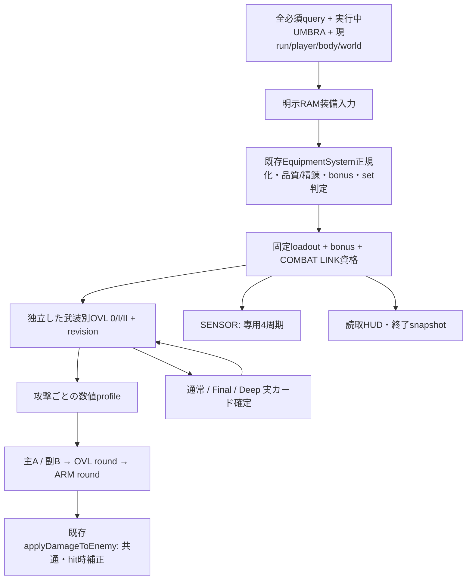

# KGK-02 UMBRA SERAPH — Phase 6D2 装備・COMBAT LINK・OVERLIMIT統合

作業日: 2026-09-08。Phase6Aの今回指定された装備・補正順・snapshot・選択制約だけを隔離試走へ接続する。装備の入手、解析、精錬、通常HANGER、購入、Atlas/Archive、Google保存は実装しない。以下の自動試験・合成XPは、自然進行、実機の操作感、深層バランスの最終合格を意味しない。

## 1. 着手時状態・変更範囲・配信対象

実ファイルのAGENTS.md、README、Phase6A指定節、6B/6C1/6C2/6D1報告、現行装備定義・run snapshot・通常OVL・Final/Deep bonus・カード確定を確認した。HEADは `28cfe5ab71048b0487254dceef6f66f3a25788f9`。着手game.jsは指定された6D1最終 **`a61a85788ce07d2ac67124f9b9cedadc9a5306e8a2b8bc33b64e2084ee66f90c`** と一致。

着手時からREADME/game/index/skillDefinitionsに未commit差分、docs/tests/専用module/画像に未追跡成果があった。148ファイルの実体・hash・Git状態を新しい `.tmp_umbra_phase6d2/2026-09-08-start/baseline/` と `start-manifest.json` に記録。過去HEAD、旧Brake、過去Phaseの試験結果へ戻していない。着手前の純350/350とブラウザ17スイートは全PASS。今回の変更量は着手snapshotとの差で数える。

|変更ファイル|目的|
|---|---|
|game.js|専用RAM snapshot／資格／OVL3経路、補正の捕捉・受付、4周期、実効カード、専用bootstrap|
|umbraDrive.js|新入口の見出し、選択源・保留・操作、装備表示|
|umbraDriveFixtures.js|明示equipment Context、正規装備7比較、開始Depth診断、純開始能力の再利用|
|umbraDriveRuntime.js|保存を含まない専用state／数値／選択helperの明示借用|
|umbraMoonlightArena.js|新規装備reset、HUD、既存cast/DEP表示、終了cleanup|
|index.html|game.jsのコード版のみ更新|
|README／6D1報告／本報告|入口の最小追記、人間確認履歴、今回の証跡|
|新規 tests/umbra-equipment-*.cjs|数値・資格・3経路・実攻撃・実UI・保護・負荷の限定検証|

コード版は変更したgame.jsと4moduleだけ `umbra-phase6d2-v1`。24Stage、9Core/9Final、TRIAD係数、equipmentDefinitions、27PNG、vendor、AGENTS、rules、保存用許可表の値・版を保持。commit/push/deploy/reset/clean/依存追加は行っていない。

最終配信sourceは12件を `final-v2/` にバイトのまま凍結し、`final-sources-v2.json` に結び付けた。game.js最終SHA-256は **`efa311b4277fd8ce45fe9781e3a9f3bd58458f68f7ae338d99f45a859c444db0`**。コードURL版の `umbra-phase6d2-v1` と、測定用凍結のv1/v2は別の識別である。最終集計は第10・13節。

## 2. Phase6D1の人間確認

6D1報告の既存本文を一切削らず、末尾へ次の3文を追記した。

> ユーザーより、Phase 6D1について人間確認では問題なしとの報告。
> 確認されたTRIADの操作・表示を維持し、Phase 6D2へ進む。
> 開始時の描画間隔差、実端末・自然進行・下流全体の未確認事項は別に残す。

確認端末・fixture・全組合せの範囲は未指定。過去の人間未確認、先頭rAF間隔、自然XPや実Robotの未確認を消したり、今回へ一般化したりしない。

## 3. 戦闘resolver・snapshot・保存分離



`EQUIPMENT_COMBAT_LINK_SKILL_IDS` は通常OVLの正規化だけでなくArchive側とも共用されているため変更しない。新しい戦闘対象resolverは専用3IDだけを返し、旧入口では元の3IDを返す。REGALIA砲も新対象にしない。

通常の `createRunEquipmentLoadoutSnapshot` は暗黙に `this.equipmentState` またはdebug presetを参照するため、そのまま借用しない。専用 `initializeUmbraGrowthRun(ramEquipment)` は現runを作り、明示RAM入力から `initializeUmbraEquipmentRun` を呼び、初期武装のruntime・初期待ちを作る前にcaptureする。通常Sceneの装備stateやショップをloadせず、既存の正規化・品質・bonus・set判定を使う。

`loadout` と `bonuses` と `qualification` をdeep freezeし、武装別OVLは別の不変値mapを成功commit時に置換する。元RAMのbestBySlot/refinement等を変えても現在runのsnapshotは変わらない。同runでの再captureは既存stateを返し、OVLを0へ戻さない。装備・機体・fixture変更は新run。

FRAME/AP、CORE/maxENは従来の `rebuildStartingStats` が1回適用し、BOOSTER回復は既存runbonus getterを参照する。今回の専用captureから開始能力を再適用しない。装備profileはsnapshot識別・revisionと数値だけで、可変stateを攻撃に渡さない。AP0/終了時は読取snapshotを残し、現state・ticket・参照は破棄する。

## 4. 装備fixtureの実定義値

内部slotはhead=SENSOR、clothes=FRAME、shoes=BOOSTER、weapon=ARMAMENT、accessory=CORE。下表は実EquipmentSystemを正規化して得た値。装備を入手・精錬した証明ではなく、開始時RAM入力である。

|RAM装備|rarity／rank／精錬|各装備品質点|SENSOR|ARM|COMBAT LINK／OVL上限|
|---|---|---:|---:|---:|---|
|none|空|0|1|1|なし／0|
|sensor|SENSORのみSR★3 +5|13|0.96|1|なし／0|
|armament|ARMAMENTのみSR★3 +5|13|1|1.186|なし／0|
|medium|5部位SR★3 +5|13|0.96|1.186|なし／0|
|ssr|5部位SSR★5 +15|20|0.9275|1.33|ssrPlusFive／I|
|legend|5部位LEGEND★5 +20|25|0.9075|1.42|legendFive／II|
|incomplete|4部位LEGEND★5 +20、CORE空|25、空0|0.9075|1.42|なし／0|

共鳴は全て0。精錬解放flagは+20の存在部位のみtrue、+15以下・空部位はfalse。`legendDiscovered`は全7構成で既定falseで、精錬上限解放flagとは別。入手・発見の試験ではない。既存上段fixtureの初期対応はbaseline=none、medium=medium、deep=legend。途中装備比較は新規resetし、元のAP・EN・球・OVLを持ち越さない。

|全身構成|従来FRAME加算AP|従来CORE加算EN|従来BOOSTER回復倍率|従来被damage倍率|
|---|---:|---:|---:|---:|
|medium|79|23|1.129|0.98|
|ssr|180|50|1.235|0.93|
|legend|235|65|1.30|0.90|
|CORE空|235|0|1.30|0.90|

これは装備による加算・倍率であり、機体・永続・CD・パッシブを合成した最終AP/ENではない。同じ装備の旧OFF/新ON比較では開始能力を揃える。異なる装備同士ではこの従来能力も異なるため、差をSENSOR/ARMだけの効果として扱わない。SSR/LEGEND混在は実set判定の最上位だけを使い、4部位のrank/精錬を高くして5部位条件の代用にしない。

## 5. 主・副の丸めと4周期

```text
R = Stage基礎 + max(0, bulletDamage - 1)
A = max(1, round(R * clamp(Core * Final(target) * TRIAD(target), .72, 1.9)))
B = max(1, round(その副対象のA * branchRate * TRIAD_PRISM))
E(X) = max(1, round(round(X * OVL) * ARMAMENT))  // 主X=A、副X=B
OVL = 1 / 1.10 / 1.20
```

`getUmbraFinalMainRawDamage` のA、`getUmbraFinalSecondaryRawDamage` のBは6D1の計算を維持。4つの受付点から `getUmbraEquipmentAttackDamage` → `applyRunEquipmentPlayerSkillDamageBonus` のcaptured profile分岐を一度通し、既存 `applyDamageToEnemy(enemy, E, tint, null)` へ渡す。`getUmbraEquipmentDamageBreakdown` はこの実装・カード・HUDで共用する。OVL I×II=1.32、A/Bを作る前へのARM混入、親のE・HP損失を副のRにする処理はない。

既存受付のstats.damageMultiplier、OVERDRIVE、vulnerable、Hunterは現在のhit時に各1回。`damageAlreadyScaled`・Support flagを追加しない。攻撃許可と正の攻撃値を先に確認し、zero damage fieldはこの受付経路自体を呼ばない。

|S8・Reactor加算0・3ASSAULT構成|MOON|SPIKE|NOVA周回|
|---|---:|---:|---:|
|3EXECUTION、強対象A|23|9|6|
|OVL II丸め後|28|11|7|
|ARM1.42後E|40|16|10|
|3PRISM、副B|6|3|2|
|副OVL II丸め後|7|4|2|
|副ARM1.42後E|10|6|3|

上表は受付前の検算値で、DPSや実HP損失ではない。混成Execution TRIADでは副対象ごとに強判定を行う。6A上限寄りのMoon R22→A42→OVL50→ARM71→共通2.66倍188.86も独立した純入力で照合した。Reactor10＋全S8＋OVL IIを自然Lv25まで無料で完成させた試験ではない。

```text
q = clamp((stats.fireInterval - 160) / 380, 0, 1)
T0 = max(floor, round(floor + (Stage基本周期 - floor) * q))
T = max(floor, round(T0 * 専用REACTOR周期係数 * SENSOR))
```

Moon/SPIKE自身のREACTORだけ0.90、NOVA pulseは1。`getRunEquipmentAdjustedSkillIntervalMs` のcaptured profile引数へCore後の未丸め値を渡す。CoreとSENSOR間の追加roundはない。旧呼び出し・旧入口を維持し、新入口SENSOR1も同値。

|Coreなし開始fixture|fire|Moon S1/S4/S8|SPIKE|NOVA周回／残留|
|---|---:|---|---:|---|
|baseline|540|750／725／650|1800|900／500|
|medium|513|683／660／593|1640|823／460|
|deep|482|604／585／527|1454|733／412|
|固有floor|―|200|500|300／200|

予定間隔と物理stepへの量子化は別。Moonには離脱・再進入が必要。`getCurrentPlayerFireInterval`、汎用70ms下限、OVERDRIVE連射は通さない。SENSORはNOVAの3000ms未満の残留・regen・800ms/120pxの設置・周回周期、SPIKE impact200ms/寿命800ms/空探索、Mutation ICD、CONTROL/field期限、100ms membership更新、FXへ適用しない。

## 6. 3つの選択機会・優先順・確定

|取得経路|発生条件|消費|候補|
|---|---|---|---|
|通常OVL|所持canonical S8、自身Core/Final済み、run資格上限未満|通常pending1|既存技能枠最大2の中で未完成Stageと同じ抽選|
|FINAL COMBAT LINK|正規Final選択成功後、その武装に1回|そのFinal bonusだけ|その武装の次OVL1候補。3枚複製しない|
|DEEP COMBAT LINK|本番Deep計算で実際にレベル上昇|そのDeep bonusだけ|現在適格な最大3武装から1つ|

装備を付けただけでは全OVL0。全武装S8やTRIAD完成は単武装OVLの条件にしない。Opening/Raid/終了/無効owner/対象Mutationの選択中または予約中は不可。Stage8のままで、Stage9/10・追加slot・Final再選択はない。

通常pending・Openingを先に処理し、既存post-overlayの順に従って選べるCore/Finalを処理、その後OVL bonus（Final先、Deep後）。既存LOST ARMS/OVERDRIVE等の後続入口は隔離側の遮断を維持する。Lは通常pending→Core/Final→OVL bonus→新しい合成XP。未処理再表示はXP0。

Final予約は成功commitの専用tokenを要求し、query、再Stage適用、失敗、旧callback、後からflagを付けた読み取りからは生成しない。予約済みFinalは表示直前に次段階を再評価し、他経路で上限なら空overlayを作らず解消する。

Deepは実 `gainExperience` → `gainDeepLevelExperience` がlevelを上げた回数を使う。現在適格な残段階からpending Final/Deep/current選択を引き、重複予約しない。S7・未取得の将来分は予約しない。Lv25最後の通常pendingとCore/Finalは保持し、Lv99以降のoverflowから新機会を作らない。Deep XP・AP式を変更していない。

選択時は既存の即時lockと360ms演出を再利用し、run、owner、skill、現在表示option、表示時の次段階を再確認する。古いIカードをIIとして確定しない。false/例外では段階と機会を消費せず、明示再表示でやり直せる。旧overlayのcallbackは現overlayへ触れない。Escは未確定のbonus機会を一度だけ待機へ戻し、再表示では新しいticket idを採番する。成功後のHUD描画例外は診断へ残し、すでに成功した段階を取り消したり二重付与したりしない。

OVL成功時は該当武装のlevel/revision/取得源回数だけ更新。Stage再適用、runtime再生成、TRIAD signature・revision・成立通知の更新は行わない。

## 7. 0差OVLとFire Controlの違い

具体的な0差は、Reactor加算0・S8 NOVAだけASSAULT＋PRISM、TRIAD中立、周回/残留・強/その他で確認した。

|装備の純比較条件|ARM|上限|OVL0→Iの主E|副E|
|---|---:|---|---|---|
|5SSR★5、精錬0|1.24|I|5→5|2→2|
|5LEGEND★5、精錬0|1.30|II|5→5|3→3|

MainのA4、副B2は×1.10の丸め後も4/2。カードは実Eの差0を表示し、Iを勝手に除外・飛ばし取得しない。II資格がある場合だけ「IはIIへの前段階」と説明する。この取得感は人間確認事項。上の精錬0は数値境界試験で、通常の比較ボタンの+15/+20と区別する。

別の実UI例は5LEGEND+20・混成Core/Final（Moon ASSAULT+EXECUTION、SPIKE CONTROL+PRISM、NOVA REACTOR+SINGULARITY）。このNOVAはA3→OVL I丸め3→ARM1.42後4で、周回/残留とも強/その他4→4となる。副はPRISMを選んでいないため発生しない。第13節の0差PNGはこの実カード構成であり、上表のASSAULT+PRISM・精錬0を撮影した画像ではない。

Fireは既存の取得済み全武装の実効周期差を純比較する。4周期へSENSORが接続されたことで、medium Fire5後のfire163で200/500/300/200msとなり、6枚目を出さない。除外のためにfireを160へ書き換えない。未取得の将来効果だけではカードを出さず、実Unlockで短縮が再び有効なら再提示する。NOVA全REGEN中も将来の正規pulse・新DEPの効果を評価する。1枚で共通statを1回変更する。

Reactorカードも新入口では共通R+1後の現在Core/Final/TRIAD・OVL・ARMによる主Eを強/その他・NOVA周回/残留別に表示する。Coreカードは受付前E、EXECUTIONはAとE、PRISMは副Eを表示する。左HUDは主攻撃のA→OVL丸め→ARM丸めを表示し、fieldダメージ0を維持する。副Bの全中間段階は第5節と数値JSONで確認し、常時HUDに全対象の副中間値まで並べてはいない。

## 8. 既存攻撃・期限・履歴の保護

|所有者|新OVLを捕捉する時点|保持するもの|
|---|---|---|
|Moon|次の正当な主受付。副もそのprofile|通過・離脱・life・lastHitAt・sweep cursor・親予算・ICD|
|SPIKE|次cast生成|生成済みR/Core/Final/TRIAD/OVL/ARM、位置・半径・impact/寿命・次cast期限|
|NOVA ORBITING|次の予定済み正規pulse|現在deadline・位相・保有枠|
|NOVA DEPLOYED|次の正常配置|旧配置のpulse/副profile、期限、field、regen負債|
|REGENERATING|再生成完了後の将来pulse|旧regen期限。取得で即補充しない|
|CONTROL/field|既存6D1規則のまま|数値・期限・membership・damageなし。装備/OVLはかけない|

100ms後にOVLを取得した旧SPIKE、旧DEPと次DEPの別profileを実カード・既存受付で確認する。攻撃中に別選択値が更新されても、同じ親からの副へ新しいOVLだけを混ぜない。既存runtimeのDepth遷移通知では装備/OVLを保持し、旧座標の攻撃・fieldはcleanup、NOVA残留/regenの残り負債は維持。人間用「開始Depth」ボタンは第12節の新runリセットであり、進行中Depth遷移とは別。AP0後は終了時表示だけで攻撃を復活させない。

## 9. 選択予算と合成XPの限界

|条件|通常枠の内訳|Mutation|Final bonus|Deep bonus|操作合計|
|---|---|---:|---:|---:|---:|
|資格なし|技能23＋passive4＝27|6|0|0|33|
|5LEGEND、通常OVLを選ばない|技能23＋passive4＝27|6|3（全I）|0|36|
|上の続き、実Deep上昇3回|同じ27|同じ6|同じ3|3（全II）|39|
|通常OVLを1回選ぶ例|技能23＋passive3＋通常OVL1＝27|6|3|0|36|

Moon S1開始、SPIKE/NOVAはUnlock、Core/Final/OVLは実カードで選択した条件。通常OVLをk回選ぶなら通常passive余白は4−k。未完成技能の抽選優先や無料Stageを追加していない。通常OVLと未完成Stageが同じdrawに競合する列も記録する。

Lv1→25までの27枠にはOpening3を含む。36→39は開始Depth6の診断fixtureで、Lが本番のDeep XP/AP計算を通りLv28へ進む。Depth6への自然到達や敵撃破によるXP獲得の証明ではない。Depth1〜5での通常Lv99までの既存分岐、Lv25最後の通常pending、未完成S7をDeepで救済しない規則を維持する。

## 10. 最終回帰・隔離・配信整合

途中の開発結果は `dev-source1/2`、`dev-runtime1`、`dev-ui1/2`、`dev-presentation1` に別保存しており、最終版の実測へ付け替えない。最初のfinal-v1では右Execution HUDが旧 `raw` 抽出条件を使い、新しいA/Eチップを拾わなかった。左装備HUDと実受付は正しかったが、右表示が欠けていたため、新装備入口だけの抽出を1行修正し、表示の純回帰を追加してfinal-v2で全ブラウザ試験を揃えた。

最終純試験は **395/395 PASS、skip0・fail0**。内訳は既存350＋新snapshot/選択11＋補正/周期/カード19＋fixture/HUD7＋旧装備5＋runtime境界3。`pure-final-v2-manifest.json` は実行前後の同じgame hash、実行した全testファイルのhash、log hashを保存する。先行の391/392件や開発途中の結果も別ファイルのまま残す。

|最終v2のブラウザ試験|結果・範囲|
|---|---|
|既存17スイート|全PASS。TRIAD戦闘21・境界9・UI38、Final/Core/Growth、S1三武装、AP0、旧2機体、Driveを再実行|
|新装備の実runtime|15/15・内部475チェック。5ケース×制御Scene 30/60/120Hz。物理60Hzを維持|
|実選択UI|112/112。33/36/39操作、通常OVL競合、Final/Deep源の消費を確認|
|カード・HUD表示|6/6。Core、Final、SSR上限I、NOVA0差Iの740/1280幅、Execution数値HUD|
|停止・終了lifecycle|3/3・内部14チェック。Esc旧callback、AP0終了snapshot、NOVA pause/Depth/新run/終了|
|敵・接触なしの操作比較|3fixture×着手6D1/現在OFF/現在ONの9走行。body/EN/Brake/Evade/正規化した全Trace列が一致|

操作比較の初回deepでは、新入口のFinal bonusをEsc保留した直後の遅延RESUME通知が2件含まれ、Trace順序だけが不一致だった。body/速度/ENはその初回も一致。失敗JSONを保持し、全側に同じ未測定3フレームを与えて既存再開通知を完了させた後、共通の測定原点を取った再試験で一致した。run/generation/commandOrderは原点との差を比較し、過去の準備履歴をバイト一致したとは呼ばない。製品の移動・通知を変更した対応ではない。

最終PNGを目視し、右Execution HUDのA/E復帰、全II・39操作後の資格/取得源、NOVA0差カードの主受付前E +0、Stage8維持、Esc保留を確認した。740pxでは縮小後の文字が小さく、枠外表示や別Textとの重なりは確認しなかったが、実スマートフォンの読みやすさ・タップ性を合格としない。新装備OVL Iの画像/簡易/FX OFFは3/3で全3主受付・SPIKE副受付・NOVA fieldが一致。初回はPRISM対象なし、2回目はMoon射程外で必要な実受付を満たさなかったためFAILを保持し、同じ対象配置を3表示側に追加して再確認した。敵HPや攻撃設定を弱めた対応ではない。

追加runtimeのうち、同step主→副境界は実SPIKE主命中callbackで敵対的なRAM OVL0→IIを注入した純probe。同じimpactの副は旧cast OVL0・同一profileを使い、B3→E4を受付へ渡した（現在IIならE6）。Moonの履歴、NOVAのREGEN/DEP/ORBIT＋予約は実normal選択commitで保持を確認した。後者はcommit自体を切り分け、比較区間に新たなworld.pause/preupdateを人工発火していない。通常pauseに伴う予約失効規則は別のブラウザ試験として扱う。

静的保護監査は、着手148ファイル中140保護ファイルが一致。旧3,322メソッド中3,288がバイト一致、変更34・新規21・削除0・許可外0。625個の既存トップレベル定数、24Stage、27PNG、vendor、equipment定義、AGENTS、rules、既存試験と過去報告を保持した。6D1報告への変更はバイト単位で追記のみ。旧系の移動/Brake/Evade/Trace227、EN/AP/receiver58、Core/Final/TRIAD主要13、保存/正規化/クラウド236メソッドも不変。これらは重複する分類であり、合計して独立機能数にしない。

HTTPは最終v2の12 source＋27 PNGで39/39一致。保存・認証・Atlas等の実機能を通すために隔離を解除していない。旧2機体の5純回帰は実Prototypeのcapture/資格/queue/open/select/completeを比較し、Graphics・Timer・physics pause・他機能post-overlay・generic TRIAD公開先を記録leafに置き換えた。通常Scene全体の実セーブやAtlas保存互換の証明ではない。

最終25実行の記録source hashは全一致。旧Moon/Driveの結果に埋込みharness hashはなく、開始時と同じハーネスの実行queue・現在bytes・着手bytes一致を集約JSONで補足した。旧ハーネスの一部はsource11件、新ハーネス等は12件を記録し、未記録vendorを記録済みとして扱わない。vendor自体の不変は保護監査とHTTPで確認した。

## 11. 性能観測・既知課題・遮断した下流

最終版で、mediumの旧入口OFF／新入口ON OVL0と、同じ5LEGENDの実カード取得OVL I／IIを別ペアで比較した。全側16体、同じ初期配置/入力規則/カメラ/画像/診断設定を使用。他の自動ブラウザ試験を終了してから、4条件を直列に観測した。

準備を分離した12秒の制御Game.step試験は性能値へ算入しない。mediumは両側で実6Mutation選択と合法なFireカードcallback5回を通す（自然カード予算の試験ではない）。LEGENDは同じ乱数seedを既存候補生成へ渡し、通常技能23・同じpassive4・Mutation6・Final bonus3の実36カードと本番Deep計算3回を通す。I側は3機会を保留、II側は実3カードで取得する。I側にも360msの実TimerでEscと次表示を入れ、両側を同じ3回の表示停止区間へ揃えた。OVL/level/pendingへの直接代入はない。準備後に位置480/500、EN満量、既存移動state・物理蓄積・Trace原点を共通resetして観測する。

初回の制御準備ではLEGENDの手動stepが1014/1012で不一致だったため比較FAILを保持。準備を揃えた再試験ではmedium各191、LEGEND各1049で、ペアごとの実カード列・全準備frame列・world pause/resume呼出列が一致。全側の観測前Scene39/physics39/武装時計650msも一致した。製品側のpauseや360ms演出を変更したものではない。

通常rAFは各約35.5秒（攻撃30.5秒＋攻撃受付OFFで経過を見る5秒）。後半はScene/worldを停止するP操作ではなく、全3攻撃を止めて残留fieldの終了を見る区間。敵は実定義`boss_crack`の基礎HP275を再利用し、実開始HPはmedium=275、LEGEND=既存Depth6補正後997で、各ペア内の16体は同値。診断用30×30の矩形body・固定開始配置・y方向70px/s往復を指定した。通常BossのAIや外形を再現した負荷ではなく、既存cap検証配置を使う反復fixtureである。1秒ごとに右→下→左→上、各先頭220msブーストの入力規則、カメラscroll200/250、画像FX、判定ガイドOFFを全側で使用した。通常rAFでの実際の入力反映時刻列はJSONへ残し、全側でフレーム時刻まで同一とはしない。

測定時harnessのmethodology文字列は「HP275」とだけ記載していたが、LEGENDの実HP997を省略していた。元JSONとharness hashを保持したまま、`final-evidence-clarifications.json`を別保存して訂正した。medium対LEGENDは開始Depth・HP・パッシブ・能力も異なり、OVLだけの性能差として比較しない。

`Game.step` CPU計測の後に、数値観測自体を別計時する。観測は各frameの受付数・body/敵HP/座標・field membership・slot・object/Timer数を採取し、この配列構築にも負荷がある。巨大な全状態snapshot、頻繁な文字列化、ファイル保存、PNG撮影は測定区間外。通常HUDや戦闘描画を消していない。独立したrAF callback間隔、rawDelta、Scene更新とphysics前後、実時刻も保存し、CPU時間と描画間隔を区別する。全外れ値を保持する。

環境はWindows、HeadlessChrome148、Phaser3.70、ANGLE/NVIDIA RTX5070/D3D11、物理fixedStep60Hz。Scene30/60/120の制御試験を実端末のHzとは呼ばない。

|Game.step CPU、ms|標本数|平均|中央値|p95|p99|最大|100ms以上|
|---|---:|---:|---:|---:|---:|---:|---:|
|medium OFF・OVL0|2,123|2.155|1.900|4.100|5.200|6.900|0|
|medium ON・OVL0|2,122|2.106|1.900|4.200|5.200|7.800|0|
|LEGEND I|2,099|1.604|1.400|3.000|4.500|7.000|0|
|LEGEND II|2,098|1.679|1.500|3.100|4.500|6.700|0|

|独立rAF間隔、ms|標本数|平均|中央値|p95|p99|最大|100ms以上|
|---|---:|---:|---:|---:|---:|---:|---:|
|medium OFF|2,122|16.730|16.700|16.800|16.900|149.976|1|
|medium ON|2,121|16.738|16.700|16.800|16.900|166.642|1|
|LEGEND I|2,098|16.921|16.700|16.800|16.900|550.008|1|
|LEGEND II|2,097|16.929|16.700|16.800|16.900|566.708|1|

数値観測側CPUは同じ標本数で平均0.01437/0.01508/0.01467/0.01459ms、中央値0、p95/p99は全0.100ms、最大0.200/0.200/0.300/0.200ms、100ms以上0。0msはタイマーの表示分解能以下を含み、観測が無料という意味ではない。上表の平均・分位点は後半の攻撃OFFも含む全区間であり、攻撃中だけの処理時間ではない。

4件の100ms以上rAF間隔はすべて先頭index0で、その後の観測中に100ms以上の反復はなかった。CPU側の全8,442標本では100ms以上0。先頭を除去した合格判定は行っていない。LEGENDの約550/567msはmediumや6D1の先頭133〜150msと同じ値ではなく、長いカード準備と因果関係があるか、ブラウザ/描画/計測開始のどこで待ったかは未確定。独立rAFのindexを特定Game.step内訳に一対一対応させず、CPUだけからGPU待ち原因を断定しない。初期差は残課題として保持する。

|戦闘・物体の記録|medium OFF|medium ON|LEGEND I|LEGEND II|
|---|---:|---:|---:|---:|
|主受付 M/S/N|6/227/146|8/217/151|4/79/27|4/80/27|
|SPIKE cast/impact|59/59|61/61|24/24|24/24|
|SPIKE副受付|59|67|23|23|
|NOVA pulse総数|311|311|165|165|
|NOVA配置/最大同時DEP/最大cycle|19/3/7|19/3/7|19/3/7|19/3/7|
|NOVA field作成/終了/最大同時|19/19/3|19/19/3|19/19/3|19/19/3|
|membership更新/入場/退場|545/10/10|545/4/4|540/3/3|540/3/3|
|撃破/生存終了|0/16|4/12|0/16|0/16|
|GameObject 開始/最大/終了|161/185/159|166/190/156|166/188/160|166/188/160|
|Timer実個数 最大/終了|11/0|9/0|7/0|7/0|
|Timer3配列長の合計 最大|22|16|14|14|

混成FinalのためPRISMはSPIKE、SINGULARITYはNOVAだけに存在する。全体6領域同時発生の試験ではなく、この構成のNOVA上限3を確認した。field cap見送りは本観測では0、SPIKE副対象なしは24/20/11/11回を記録した。mediumは新装備で敵が4体先に倒れ、受付数・対象位置・後半の負荷も変わる。CPU平均差を補正演算単体のコストや改善率に換算しない。

|時刻と更新回数|medium OFF|medium ON|LEGEND I|LEGEND II|
|---|---|---|---|---|
|performance.now 開始→攻撃OFF直前→終了、ms|1484.5→31824.4→36826.0|1262.0→31587.9→36592.1|1630.0→31568.1→36569.9|1639.5→31567.9→36570.4|
|Scene開始→OFF直前→終了|39→1861→2162|39→1860→2161|39→1837→2138|39→1836→2137|
|physics開始→OFF直前→終了|39→1859→2160|39→1858→2159|39→1835→2136|39→1834→2135|
|Game callback timestamp経過、ms|35500.476|35500.342|35500.708|35500.708|

performance.nowの開始/終了差は35341.5/35330.1/34939.9/34930.9msで、Game callback timestamp差とは一致しない。計測開始境界と時刻源を区別して両方残す。物理実回数もScene更新数と異なるため、35.5秒×60として回数を捏造しない。

開始→攻撃OFF直前はworld/Scene/gameのlistener一覧が一致し、終了時に増加したlistenerは0。攻撃OFF後はfield/主CONTROL記録/Timer実個数が全0となった。NOVAの既存無効化でTRIAD owner/bindingが3→2となり、関連listenerも減る。これは攻撃OFFに伴う既存cleanupで、OVL取得時のTRIAD再集計ではない。終了GameObjectはHUD・敵等を含み0を期待しない。観測区間内の有限性を確認した結果で、長時間のメモリリーク不在を保証しない。

過去のPhase4 Game.step最大800.3ms、Phase3の565.3ms、6C/6D1の開始描画間隔差は計測範囲が異なり、今回の最大値から改善率・解消済みを主張しない。CPU時間だけでGPU待ちを推定しない。有限の観測で全端末・長時間の滑らかさを保証しない。

6D1で記録されたFIELD_CAP20回は有限領域の生成を見送った回数であり、主impactは維持されていた。装備による頻度増加で見送りが増えても、生成枠や対象数を増やして隠さない。領域上限はMoon1・SPIKE2・NOVA3の既存値のまま。

実Deepの計算・RAM進行・AP表示までを通し、GEEKや実OVERDRIVE報酬、装備箱/解析/精錬/購入/保存、Atlas/Research、認証/ランキング/クラウドを遮断する。6D1の既存ゲージ倍率と、実Robot/Support/OVERDRIVE MOD全体の下流未確認は別に残す。

|隔離場で通した範囲|扱い|
|---|---|
|gainExperience / gainDeepLevelExperience / Deep XP要求値 / AP上昇|製品関数とRAM stats・HUDを使用。敵からの自然XPではなく合成入力|
|通常・Core・Final・OVL選択|実カードlock・360ms・確定・保留・後続を使用|
|damage receiver / 敵撃破|既存受付・HP・arena内の撃破数。通常報酬保存へ接続しない|
|GEEK・実OVERDRIVE報酬・LOST ARMS進化等|隔離側の既存leaf遮断。計算確認のために本番報酬を解放しない|
|装備load/save・Atlas/Research・解析/精錬/購入|専用moduleの借用対象外。実装・保存対応の検証対象にしない|
|Storage / 通常Scene / 認証・ランキング・クラウド|新規の隔離BrowserContextでStorageデータAPI0、監視対象の通常/認証/ランキング入口0、firebase未ロード、外部要求0|

起動互換確認としてlocalStorageプロパティの存在probeは初期に1回あり、StorageデータAPIアクセスとは区別する。その後のprobe増加も0で、実アカウントの保存域は読んでいない。

## 12. 人間用のURLと操作

新入口: `http://127.0.0.1:4173/?umbraPreview=1&umbraDrive=1&umbraGrowth=1&umbraCore=1&umbraFinal=1&umbraTriad=1&umbraEquipment=1`

旧6D1比較: `http://127.0.0.1:4173/?umbraPreview=1&umbraDrive=1&umbraGrowth=1&umbraCore=1&umbraFinal=1&umbraTriad=1`

1. 新入口の `PHASE 6D2 TEST / 装備・OVERLIMIT統合 / 通常販売未実装 / 進行保存なし` を確認。上段のbaseline/medium/deepは開始能力全体のfixture。
2. 「RAM装備」は上記7構成を順送りし、毎回同じ開始位置から新規reset。装備比較を進行中に付け替えない。「開始Depth 1/6」も新規reset。連続成長ではLv1＋Opening3、直接Stage比較では選んだ比較Stageを保持しOpeningなしで始める。
3. 「連続成長へ新規リセット」はMoon S1から。「比較武装」と「新規比較S1/S4/S6/S8」は直接Stageの検証で、自然成長と区別する。Core/Final/OVLは直接比較でも実カードで選ぶ。
4. Lで通常pending→Core/Final→OVL bonus→合成XP。1/2/3、クリック/タップで選び、Escで保留。追加カードは1〜3枚で、1候補を3枚に複製しない。未処理カード再表示はXPを加えない。
5. 装備上限だけではOVL0。5SSR/5LEGENDで各S8＋Core/Finalを完成させ、通常候補とFinal bonusを比較。Depth6・Lv25以降のLは実Deep計算を通す。
6. WASD/矢印＋SHIFT/SPACEで走行。P停止/復帰、H判定、T Trace表示。R・上fixture・機体・装備・配置変更は新規試験。AP0はPで復帰せずRで新規試験。HUDは現在OVLと旧cast/DEPの保持OVL/revisionを区別する。

旧OFFと新ONの攻撃補正だけを比較する場合は同じ上段fixture・初期装備（baseline/medium/deep）・Stage/Core/Final・敵配置・入力に揃える。異なる装備間のFRAME/APやBOOSTER/CORE差は別に評価する。装備の体感、0差Iを取得する納得感、装備とTRIADの情報量は今回あらためて人間確認が必要。

## 13. 証跡・再実行・実関数の位置

証跡はすべて `.tmp_umbra_phase6d2/2026-09-08-start/` 以下へ新規保存。過去の報告・JSON・失敗・再試行を上書きしていない。

現在の関数位置は上記game.js最終hashのもの。

|役割|現行関数とgame.js行|
|---|---|
|開始前capture／Context／戦闘ID|63870 `initializeUmbraGrowthRun`、63890 `isUmbraEquipmentContextActive`、63898 `getEquipmentCombatLinkTargetSkillIds`|
|capture／固定参照／数値profile／終了|63902 `initializeUmbraEquipmentRun`、63925 `getUmbraEquipmentSnapshot`、63938 `getUmbraEquipmentCombatProfile`、63953 `destroyUmbraEquipmentRun`|
|資格／実効カード／commit|63964 `canUpgradeUmbraEquipmentOverlimit`、63976 `buildUmbraEquipmentOverlimitChoice`、64021 `applyUmbraEquipmentOverlimitChoice`|
|Final／Deep予約|64048 `queueUmbraFinalOverlimitBonus`、64058 `queueUmbraDeepOverlimitBonus`、64438 `applyUmbraFinalChoice`|
|表示・保留・失敗|64080 `tryOpenUmbraEquipmentOverlimitBonusSelection`、64104 `closeUmbraEquipmentOverlimitSelection`、64116 `rejectUmbraEquipmentOverlimitSelection`、84236 `completeLevelUpCardSelection`|
|Eの接続と共用丸め|15439 `applyRunEquipmentPlayerSkillDamageBonus`、64600 `getUmbraEquipmentAttackDamage`、64610 `getUmbraEquipmentDamageBreakdown`|
|SENSOR4周期|15454 `getRunEquipmentAdjustedSkillIntervalMs`、81692 Moon、81757 SPIKE、81822 NOVAのInterval getter|
|実XPと優先順|81490 `gainExperience`、37970 `gainDeepLevelExperience`、37026 `tryOpenPendingPostOverlaySelections`|

主要証跡（以下の相対名はすべて上記証跡rootからのもの）:

|対象|実ファイル|
|---|---|
|着手・凍結|`start-manifest.json`、`baseline-browser-completion.json`、`final-sources-v2.json`|
|純試験|`pure-final-v2-complete.txt`、`pure-final-v2-manifest.json`|
|既存ブラウザの直列実行|`final-v2-browser-queue.json`。各17結果の格納先・開始終了・harness hash・引数を記録|
|新runtime|`final-v2-equipment-runtime/equipment-browser-1788869275487.json`|
|実UI・取得予算|`final-v2-equipment-ui/equipment-ui-1788869320797.json`|
|カード・HUD|`final-v2-equipment-presentation/equipment-presentation-1788869329705.json`|
|操作一致|`final-v2-equipment-parity2/equipment-parity-1788869477740.json`。初回不一致は`final-v2-equipment-parity/`に保持|
|終了・callback・Depth|`final-v2-equipment-lifecycle/equipment-lifecycle-1788869349808.json`|
|新装備3描画|`final-v2-equipment-fx3/equipment-fx-1788869665632.json`。未充足だった初回/2回目も別保存|
|12秒制御の準備資格確認|`final-v2-equipment-controlled3/equipment-observation-controlled-1788870379511.json`|
|35.5秒×4の通常rAF|`final-v2-equipment-raf/equipment-observation-raf-1788869887058.json`|
|ブラウザ全25実行|`final-browser-completion-v2.json`。旧17＋新機能/観測8、全PASS・記録source一致|
|性能集約とHP記述訂正|`final-performance-summary-v2.json`、`final-evidence-clarifications.json`|
|JSON/PNG等の索引|`final-artifact-index-v2.json`。最終結果と再試行履歴の85参照をhash付きで記録|
|最終source・証跡・文書整合|`final-verification-v2.json`。凍結/current/source、純/ブラウザ/HTTP/構文結果hash、最終文書hashを関連付ける|
|HTTP12 source＋27画像|`final-v2-http/http-1788868969922.json`|
|保護監査|`final-v2-http/equipment-preservation-1788868970198.json`|
|実定義数値表|`numeric/equipment-numeric-1788868734765.json`。game hashは最終EFAと同じ|

代表画像:

- [全II・39操作後HUD](../.tmp_umbra_phase6d2/2026-09-08-start/final-v2-equipment-ui/equipment-legend-budget-39.png)
- [Deepの3候補](../.tmp_umbra_phase6d2/2026-09-08-start/final-v2-equipment-ui/equipment-legend-deep-three-candidates.png)
- [SSR上限Iの実カード](../.tmp_umbra_phase6d2/2026-09-08-start/final-v2-equipment-presentation/equipment-ovl_ssr.png)
- [NOVA 0差I・1280px](../.tmp_umbra_phase6d2/2026-09-08-start/final-v2-equipment-presentation/equipment-ovl_zero_desktop.png)、[740px](../.tmp_umbra_phase6d2/2026-09-08-start/final-v2-equipment-presentation/equipment-ovl_zero.png)
- [ExecutionのA/E HUD](../.tmp_umbra_phase6d2/2026-09-08-start/final-v2-equipment-presentation/equipment-execution_hud.png)

ブラウザ再実行は既存のローカルHTTPサーバーと同梱runtimeのPlaywright/既存Chromiumを使う。追加インストールは不要。各試験の出力先は新しい空の名前にし、以下を順番に実行する。既存17本の正確な引数はqueue JSONを参照。

```powershell
$env:NODE_PATH = 'C:/Users/akina/.cache/codex-runtimes/codex-primary-runtime/dependencies/node/node_modules'
$env:UMBRA_TEST_BROWSER = 'C:/Users/akina/AppData/Local/ms-playwright/chromium-1223/chrome-win64/chrome.exe'
$env:UMBRA_TEST_SOURCE_ROOT = 'H:/ラスメモヴァンサバゲーム/.tmp_umbra_phase6d2/2026-09-08-start/final-v2'
$env:UMBRA_TEST_OUTPUT = 'H:/ラスメモヴァンサバゲーム/.tmp_umbra_phase6d2/manual-recheck-new'
node --test (Get-ChildItem -LiteralPath tests -Filter 'umbra-*.test.cjs').FullName
node tests/umbra-equipment-browser.cjs
node tests/umbra-equipment-ui-browser.cjs
node tests/umbra-equipment-presentation.cjs
node tests/umbra-equipment-parity.cjs
node tests/umbra-equipment-lifecycle.cjs
node tests/umbra-equipment-fx-browser.cjs
node tests/umbra-equipment-observation.cjs --controlled
node tests/umbra-equipment-observation.cjs
```

同じ出力名で再実行するとPNG名が重なるため、各再試行の`UMBRA_TEST_OUTPUT`は変更する。rAF観測は他のブラウザ試験を全て終了してから行う。最終構文確認は`syntax-final-v2-1788869991971.json`に23ファイルのhash・終了コードを保存し、全PASS。必須のgame/skill/stage/equipmentと変更4module、新規診断15本を含む。`git diff --check`も終了コード0。構文確認は性能観測完了後に実行した。

```powershell
node --check game.js
node --check skillDefinitions.js
node --check stageDefinitions.js
node --check equipmentDefinitions.js
node --check umbraDrive.js
node --check umbraDriveRuntime.js
node --check umbraDriveFixtures.js
node --check umbraMoonlightArena.js
git diff --check
```

開発途中の一部純試験失敗stdoutは担当tool transcriptにのみ残り、後から当時の生logとして生成してはいない。VM/host Arrayのrealm差、fixtureの不足stub、数値検算の丸め期待はハーネスを補正。製品ではOVL表示例外時のactive解除、古い360ms callbackによる新overlay閉鎖を局所修正し、対応純回帰を追加した。最終v2の成立結果と区別する。

最終クロスチェックの初回`final-verification.json`は、controlled2の採取後にハーネスへ「Moon受付が正」「準備world/frame一致」を合否必須条件として追加したため、現在ハーネスとのhash不一致を1件検出してFAILとなった。製品・結果JSONの変更は0。`controlled-harness-predicate-audit.json`でその2条件だけを逆変換すると旧harness hashに一致することを確認し、現ハーネスで制御4構成だけcontrolled3へ再実行して全PASS。最初の検証JSON・旧集約は保持し、最終集約に`-v2`を付けて別保存した。通常rAFは再測定せず、summary-v2内の通常rAF部分は旧summaryと同一である。

## 14. 公開・保存対応前の残課題

隔離での数値・選択・既存受付との戦闘接続結果であり、通常戦闘Scene全体の装備対応完了ではない。人間の操作感・視認性・0差段階の納得感、実スマートフォン、自然XPの取得難度、深層生存性、全特殊Boss、実Robot/Support/OVERDRIVE MODの下流、長時間/GPU全端末性能は別確認が必要。

開始rAF間隔差、過去の大きい遅延、角脱出の断続失敗・保守除外、boostSustainDrainRampMs/boostSustainRampMs不一致は今回の修正対象へ広げていない。保存キー追加・schema拡張は0。GEEK、ANJU MEMORY、LOST ARMS、DATA CACHE、OVERDRIVE、STABILIZEの報酬・保存・Depth発生/解除規則は変更していない。通常ショップ/ランキング/販売UIも変更していない。

**Phase 6D2：装備・COMBAT LINK・OVERLIMIT統合の実装結果。通常HANGER公開、購入、Atlas/Archive、Google保存対応は未着手**

## 15. Phase 7A設計開始時の人間確認追記（2026-09-08）

ユーザーより、Phase 6D2について人間確認では問題なしとの報告。
確認された装備・COMBAT LINK・OVERLIMITの操作・表示を、
通常プレイ接続の比較基準として維持する。

確認端末、fixture、0差OVLの個別条件は未指定。自然進行、深層バランス、通常Scene全体、全端末、過去の描画間隔差の解消まで合格とするものではない。上記の未確認記録は維持し、今回の確認を追記の履歴として残す。
